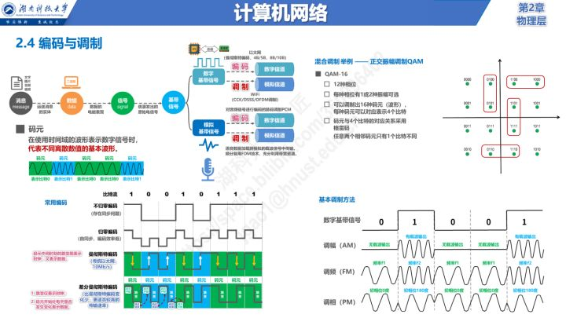
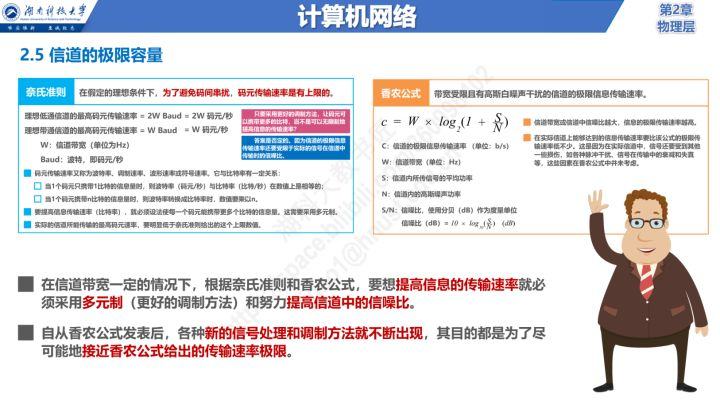

# ISO
OSI(Open System Interconnection)开放式系统互联
OSI模型是一种进行数据封装的网络模型。（理论上)
OSI模型简化后，实际用的是TCP/IP模型

[计算机网络](https://www.icourse163.org/course/HNKJ-1461816178)
## TCP/IP模型工作原理
我们平常使用的程序（或者说软件）一般都是通过应用层来访问网络的。
程序发送到数据包时会一层一层地往下传输，最终，网络接口层通过网线发送到互联网上。
数据每往下走一层，就会被这一层的协议增加一层包装，即，互联网上的数据比原始数据多了四层包装。
整个数据封装的过程就像**俄罗斯套娃**。

接收到数据包时，会从网络接口层开始一层一层往上传输，
每传输一层就拆开一层包装，最终，应用层就能得到最原始的数据，即程序要使用的数据。

给数据加包装的过程，实际上就是在数据的**头部增加一个标志（一个数据块）**，表示数据经过了这一层，我已经处理过了。
给数据拆包装的过程正好相反，就是去掉数据头部的标志，让它逐渐现出原形。

## 原则
**必须是同一层次进行通信**，比如，A 计算机的应用层和 B 计算机的传输层就不能通信，因为它们不在一个层次，数据的拆包会遇到问题。
**每一层的功能都必须相同**，也就是拥有完全相同的网络模型。如果网络模型都不同，那不就乱套了，谁都不认识谁。
**数据只能逐层传输，不能跃层**。
**每一层可以使用下层提供的服务，并向上层提供服务**。

---

# 物理层
物理层为设备之间的数据通信提供传输媒体及互连设备，为数据传输**提供可靠的环境**。
如果您想要用尽量少的词来记住这个第一层，那就是“**信号和介质**”

物理层协议
* 点对点通信线路物理层协议
* 广播通信线路物理层协议，其中广播通信线路又分为
  * 有线通信线路（网线形式的网络）
  * 无线通信线路（WIFI）

  

## 传输媒体
* 引导型传输媒体
  * 同轴电缆
  * 双绞线
  * 光纤
  * 电力线
* 非引导型传输媒体
  * 无线电波
  * 微波
  * 红外线
  * 可见光
## 传输方式
* 根据传输通道数量分：
  * 串行通信：将一个字符的二进制代码按从低位到高位顺序传输，传输中需要建立一个信道。
  * 并行通信：将一个字符的二进制代码同时通过8条信道同时传输，每发送一个字符都需要建立8条信道，成本较高。

* 根据收发双方发送时间分：
  * 同步：同步传输指的一起传输，但是需要时钟信号
  * 异步：异步传输指的是字节之间异步
PS:可以理解为一个bit的电路持续时间

* 根据信号发送的方向和时间关系可分：
  * 单工通信：只能向一个方向发送信息，例如广播、电台、寻呼机
  * 半双工通信：同一时刻只能有一个方向发送信息，例如对讲机
  * 全双工通信：可以同时发送信息和接收信息，例如手机、电话

## 编码与调制
* 调制：将数字信号转换为模拟信号（modem 猫：调制解调器）
  * 数字基带信号
  * 调幅AM
  * 调频FM
  * 调相PM
* 解调：将模拟信号转换为数字信号
  * 比特流（0 1）
  * 不归零编码（1 -1
  * 归零编码（01 10）
  * 曼彻斯特编码（向下 向上）
  * 差分曼彻斯特编码

在物理层的传输介质中传输的信号共分为两种
实际传输的是什么信号是有两端的物理层设备决定的。
* 模拟信号（家里的电话、有线电视）
* 数字信号（电脑上网）

## 信道容量
即：单位时间最多可以传递多少码元

奈氏准则：要提高信息传输率，就要让码元携带尽可能多的比特信息，即需要跟好的调制方法。
香农公式：传输速率极限 c=W*log2(1+S/N)

[参考资料](https://zhuanlan.zhihu.com/p/480781989)
# 数据链路层
将源自网络层来的数据可靠地传输到相邻结点的网络层
将物理层提供的可能出错的物理连接改造成为逻辑上无差错的数据链路
网络中的主机、路由器等都必须实现数据链路层；局域网中的主机、交换机等都必须实现数据链路层
## 封装成帧(framing) 
就是在一段数据的前后分别添加首部和尾部，然后就构成了一个帧。
* 帧定界符
  * SOH(Start Of Header)帧最前面，表示帧开始
  * EOT(End Of Transmission)帧最后面，表示帧结束
## 透明传输
* 问题
  * 数据中的某字节的二进制代码恰好和 SOH 或 EOT 一样，链路层就会错误地“找到帧的边界”
* 需求
  * 不管所传数据是什么样的比特组合，都能够在链路上传送
* 解决方案：
  * 字符计数：在帧首部使用计数字段来表示帧内字符数（一错，全错）
  * 字符填充（character stuffing）：在数据中的SOH和EOT前，增加转义字符`ESC`
## 差错检测
* 出错原因：在传输过程中，由于噪声引起差错
  * 全局性噪声：由于线路本身的电气特性所产生的随机噪声，是信道固有的，随机存在的。
    * 解决办法：提高信噪比来减少或避免干扰。
  * 局部性噪声：外界特定的短暂原因造成的冲击噪声，是产生差错的主要原因。
    * 解决办法：通常利用编码技术来解决
* 出错类型
  * 位错
    * 奇偶校验（校验位放在最后，只能检测及数个比特错误）
      * 偶校验
        * 数据位和为偶数：校验位为0；
        * 数据位和为奇数：校验位为1；
      * 奇校验
        * 数据位和为奇数：校验位为0；
        * 数据位和为偶数：校验位为1；
    * CRC循环冗余码
      * 使用的是模2除（被除数高位为1就够除，商1）
  * 帧错
[参考资料](https://zhuanlan.zhihu.com/p/511115797)
# 交换机工作原理
# VLAN和TRUNK
# 网络层
# 网关和ARP
# 路由原理
# OSPF
# 传输层

# 参考资料
[关于 TCP/IP，必知必会的十个问题 ](https://juejin.im/post/6844903490595061767)
[ISO七层协议模型架构、各层的解析及其协议](https://blog.csdn.net/ChenGuiGan/article/details/80963507)