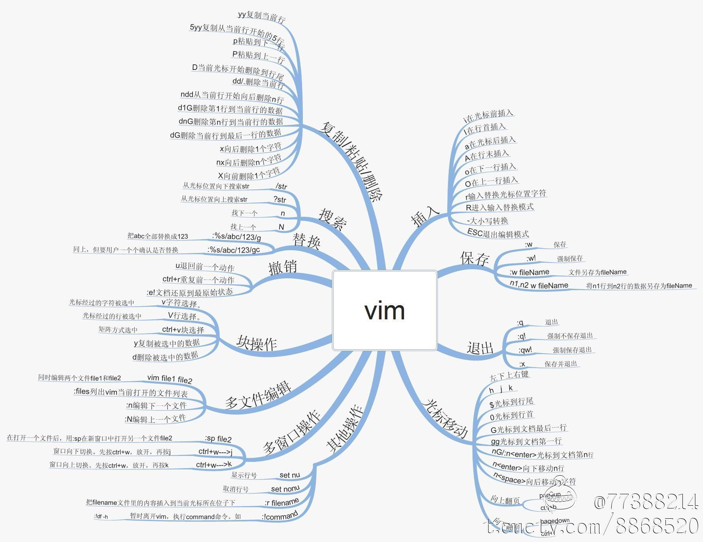

**[Home](../../Menu.md)**
作者：
[TOC]
# Vim
## 工作模式介绍
>TODO
### 普通模式
* 切换命令
>TODO
### 插入模式命令
* 切换命令
>TODO
### 命令模式命令
* 切换命令
>TODO
#### 常用命令
##### 增
>TODO
##### 删
>TODO
##### 改（包括批量替换）
>TODO
##### 查
>TODO
##### 显示行号
>TODO

# 参考资料
