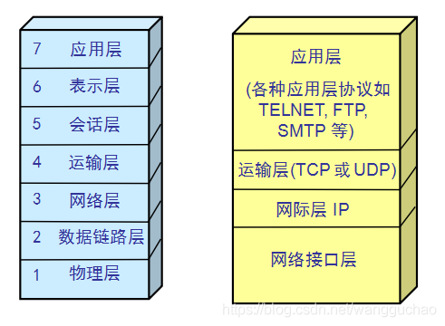
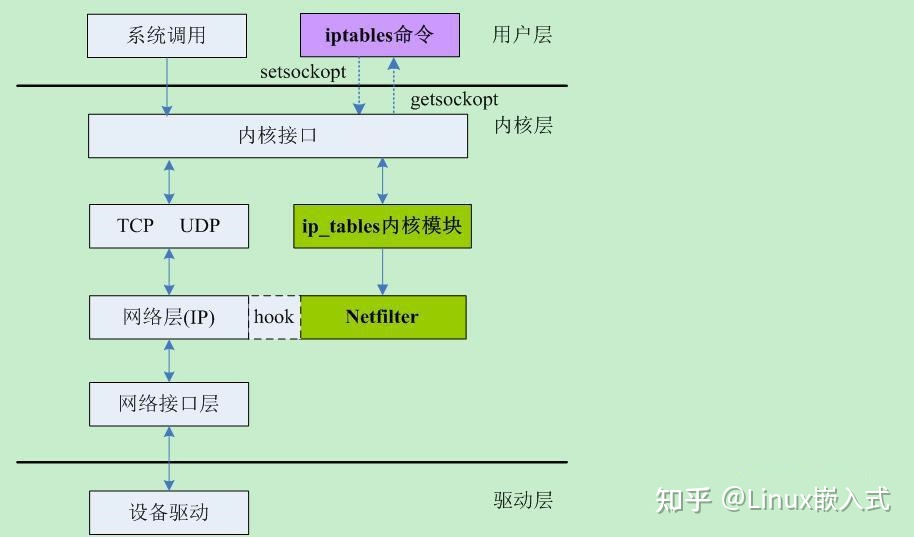
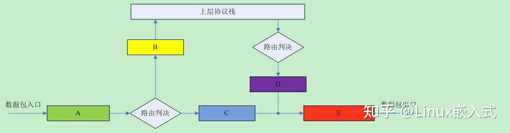

初步了解下这是啥， 
主要有什么应用场景， 
可以加上根据你的理解有没有深入这块的需要；本周六 

eBPF：内核里的虚拟机，允许用户的程序在内核中运行
XDP:是Linux 内核中提供高性能、可编程的网络数据包处理框架

# 网络系统分层结构

# 优秀的防火墙技术 Netfilter & iptables
结构

下图协议栈那五个关键点A，B，C，D和E就是我们Netfilter大展拳脚的地方，对数据包进行各种操作

## 问题
* 路径太长：netfilter 框架在IP层，报文需要经过链路层，在IP层才能被处理
* O(N)匹配：极端情况下，报文需要依次遍历所有规则，才能匹配中
* 规则太多：没有对添加规则进行合并优化，操作人员技术水平和规模都影响性能。
* 影响网络数据传输的瓶颈发生了转移
  * 随着网卡性能增强，数据快速收入，处理效率急需提升，压力给到**内核**
  
## 内核协议栈各种优化措施（重构）
* **upload方法**：让应用程序自己去网卡直接拉数据。
  * **DPDK**让用户态程序直接处理网络流，bypass掉内核，使用独立的CPU专门干这个事。
* **offload方法**：让网卡自己处理网络逻辑。
  * **XDP**让灌入网卡的eBPF程序直接处理网络流，bypass掉内核，使用网卡NPU专门干这个事。

---

# eBPF & XDP
BPF实际上并不只是包处理，而更像一个VM(virtual machine)

BPF 是 RISC 指令集
用 C 语言的一个子集编 写程序，
然后用一个编译器后端（例如 LLVM）将其编译成 BPF 指令，
稍后内核再通 过一个位于内核中的（in-kernel）即时编译器（JIT Compiler）将 BPF 指令映射成处理器的原生指令（opcode ）

BPF 是 Linux 内核中高度灵活和高效的类似虚拟机的技术，允许以安全的方式在各个挂钩点执行字节码。它用于许多 Linux 内核子系统，最突出的是网络、跟踪和安全（例如沙箱）。

那XDP又是什么?
XDP的全称是： eXpress Data Path
XDP 是Linux 内核中提供高性能、可编程的网络数据包处理框架

### 优点
* 无需第三方代码库和许可
* 同时支持轮询式和中断式网络
* 无需分配大页
* 无需专用的CPU
* 无需定义新的安全网络模型

### 缺点
注意XDP的性能提升是有代价的，它牺牲了通用型和公平性
* XDP不提供缓存队列（qdisc），TX设备太慢时直接丢包，因而不要在RX比TX快的设备上使用XDP
* XDP程序是专用的，不具备网络协议栈的通用性
* 
---

# 参考资料：
* [基础（网络知识 一）——网络结构的组成](https://blog.csdn.net/wangguchao/article/details/106635528)
* [洞悉linux下的Netfilter&iptables](https://zhuanlan.zhihu.com/p/486823403)
* [超细节！十年码农讲述eBPF和XDP技术！](https://zhuanlan.zhihu.com/p/558509760)
* [BPF、eBPF与XDP简介与使用 ](https://www.cnblogs.com/lfri/p/15411668.html)
* [万字长文|深入理解XDP全景指南](http://www.360doc.com/content/12/0121/07/69626087_1015529754.shtml)

