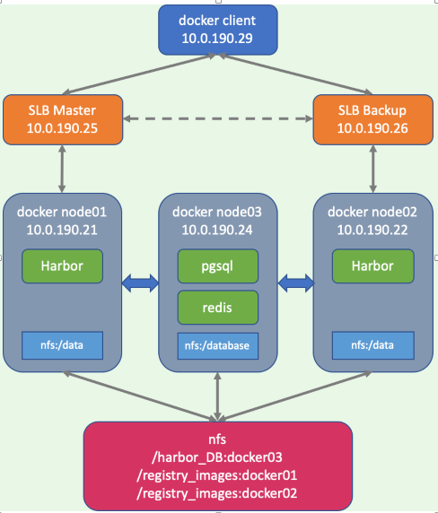

## 基础概念及安装
### 架构：C/S
相关组成：
镜像：image，一个静态的，已经部署完毕的文件系统
容器：container，一个动态的，正在运行的image，可以创建、删除、启动、停止、暂停
仓库：Repository，用于保存镜像
Client：运行命令行或其他工具使用docker
Host：运行Docker守护进程和容器的主机（虚拟机）


### CentOS安装：
#### 设置yum源
1. 安装yum工具
```
$ sudo yum install -y yum-utils    device-mapper-persistent-data    lvm2
```
2. 安装docker安装源
```
$ sudo yum-config-manager      --add-repo      https://download.docker.com/linux/centos/docker-ce.repo
```
#### 安装docker
```
$ sudo yum install docker-ce docker-ce-cli containerd.io
```
#### 启动docker服务
```
$ sudo systemctl start docker
```
#### Docker加速器：
```
$ sudo curl -sSL https://get.daocloud.io/daotools/set_mirror.sh | sh -s http://f1361db2.m.daocloud.io
$ sudo systemctl daemon-reload
$ sudo systemctl restart docker
```

#### Docker 配置文件模板
* Docker配置文件位置：
```
# cat /etc/docker/daemon.json
 {
 "api-cors-header": "", 
 "authorization-plugins": [],
 "bip": "",
 "bridge": "",
 "cgroup-parent": "",
 "cluster-store": "",
 "cluster-store-opts": {},
 "cluster-advertise": "",
 #启用debug的模式，启用后，可以看到很多的启动信息。默认 false
 "debug": true, 
 "default-gateway": "",
 "default-gateway-v6": "",
 "default-runtime": "runc",
 "default-ulimits": {},
 "disable-legacy-registry": false,
 #容器DNS的地址，在容器的/etc/resolv.conf 文件中可查看
 "dns": ["192.168.80.1"], 
 "dns-opts": [],
 "dns-search": [],
 "exec-opts": [],
 "exec-root": "",
 "fixed-cidr": "",
 "fixed-cidr-v6": "",
 #已废弃，使用data-root代替
 "graph": "/var/lib/docker", 
 #Docker运行时使用的根路径,根路径下的内容稍后介绍，默认/var/lib/docker
 "data-root": "/var/lib/docker", 
 "group": "", #Unix套接字的属组,仅指/var/run/docker.sock 
 "hosts": [], #设置容器hosts
 "icc": false,
 "insecure-registries": [],
 "ip": "0.0.0.0",
 "iptables": false,
 "ipv6": false,
 "ip-forward": false,
 "ip-masq": false,
 "labels": ["nodeName=node-121"],
 "live-restore": true,
 "log-driver": "",
 "log-level": "",
 "log-opts": {
    "max-file": "5",
    "max-size": "50m"
 },
 "max-concurrent-downloads": 3,
 "max-concurrent-uploads": 5,
 "mtu": 0,
 "oom-score-adjust": -500,
 "pidfile": "", #Docker守护进程的PID文件
 "raw-logs": false,
 "registry-mirrors": ["xxxx"], #镜像加速的地址，增加后在 docker info 中可查看。
 "runtimes": {
 "runc": {
 "path": "runc"
 },
 "custom": {
 "path": "/usr/local/bin/my-runc-replacement",
 "runtimeArgs": [
 "--debug"
 ]
 }
 },
 "selinux-enabled": false, #参考：Docker的启动参数
 "storage-driver": "overlay2",
 "storage-opts": [],
 "swarm-default-advertise-addr": "",
 "tls": true, #参考：Docker的启动参数
 "tlscacert": "", #参考：Docker的启动参数
 "tlscert": "", #参考：Docker的启动参数
 "tlskey": "", #参考：Docker的启动参数
 "tlsverify": true, #参考：Docker的启动参数
 "userland-proxy": false,
 "userns-remap": ""
 }
```
## 基本操作
### 运行一个容器，并运行一个应用
```
$ docker run <image_name:version> [<command>]
e.g.
$ docker run ubuntu:15. 10 /bin/echo "Hello world"
```

### 运行一个交互式容器
```
$ docker run -i -t <image_name:version> /bin/bash
e.g.
$ docker run -i -t ubuntu:15. 10 /bin/bash
```
### 通过exit命令或【ctrl+d】退出容器

### 后台运行一个容器
```
$ docker run -d <image_name:version> [<command>]
e.g.
$ docker run -d ubuntu:15.10 /bin/sh -c "while true; do echo hello world; sleep 1; done"
$ docker run -itd ubuntu:15. 10 /bin/bash
```
注：接了-d参数，不会进入该容器，若要进入，需要使用docker exec命令

### 运行一个容器并命名
```
$ docker run -d --name <customed_name> <image_name:version> [<command>]
e.g.
$ docker run -d --name runoob training/webapp python app.py
```

### 运行一个容器，制定容器OS内的主机名和DNS
```
$ docker run -it -h <hostname> --dns=<DNS IP> --dns-search=<domain name> REPOSITORY[:tag]
e.g.
$ docker run -it -h host_ubuntu --dns=114. 114.114.114 --dns-search=test.com ubuntu
```

### 运行一个容器，限制内存资源
```
$ docker run -it -m <memory size M> --memory-swap <swap size M> <image_name:version>
e.g.
$ docker run -it -m 200M --memory-swap 300M ubuntu:16.04
```

### 运行容器，设置cpu权重
默认情况下，所有容器可以平等的使用宿主机cpu资源且没有限制。docker可以通过-c或--cpu-shares设置容器使用的cpu的权重。如果不指定，默认为1024。
```
$ docker  docker docker run -c <cpu weight> <image_name:version>
e.g.
$ docker  docker run --name container_A -c 1024 ubuntu
$ docker  docker run --name container_B -c 512 ubuntu
```

### 运行容器，设置bps\io限制
限制bps和iops的参数说明：
* --device-read-bps，限制读某个设备的 bps。
* --device-write-bps，限制写某个设备的 bps。
* --device-read-iops，限制读某个设备的 iops。
* --device-write-iops，限制写某个设备的 iops。
bps是byte per second，每秒读写的数据量 iops是io per second，每秒io的次数
e.g.
```
$ docker  docker run -it --device-write-bps /dev/sda:30MB ubuntu
```


### 容器的启动过程说明：
* 检查本地是否存在指定的镜像，如果没有就从指定的仓库下载
* 利用镜像启动一个容器
* 分配一个文件系统，并在只读的镜像层外面挂载一层可读写层
* 从宿主机配置的网桥接口中桥接一个虚拟接口到容器中去
* 从地址池配置一个IP给容器
* 执行用户指定的程序 
* 执行完毕后停止容器


### 查看容器进程
```
$ docker ps
CONTAINER ID        IMAGE               COMMAND                  CREATED             STATUS              PORTS               NAMES
0bfffdebcec6        ubuntu:15.10        "/bin/sh -c 'while t…"   7 seconds ago       Up 6 seconds                            pedantic_jang
```
CONTAINER ID  容器ID
IMAGE  使用的镜像和版本
COMMAND  启动容器是运行的命令
CREATED  创建时间
STATUS  当前状态
| created | restarting | running | removing | paused | exited | dead |
| ------- | ---------- | ------- | -------- | ------ | ------ | ---- |
| 已创建  | 重启中     | 运行中  | 迁移中   | 暂停   | 停止   | 死亡 |
PORTS  端口号信息和协议类型
NAMES 自动分配的容器名称

### 查看容器内的STDOUT
```
$ docker logs <container id>|<name>
$ docker logs -f <container id>|<name>
e.g.
$ docker logs 0bfffdebcec6 
$ docker logs -f a0b880b71647
```
注：【-f】可以像tail -f一样，实时输出容器内的STDOUT

### 获取镜像
```
$ docker pull <image_name>[:<version>]
e.g.
$ docker pull ubuntu
```

### 启动已停止的容器
```
$ docker start <container id>
e.g.
$ docker start cbb633cf14c2
```

### 停止容器
```
$ docker stop <container id>
e.g.
$ docker stop cbb633cf14c2
```

### 重启容器
```
$ docker restart <container id>
e.g.
$ docker restart cbb633cf14c2
```

### 进入容器
```
$ docker attach <container id>
e.g.
$ docker attach cbb633cf14c2
```
注：一旦退出容器，该容器将停止
```
$ docker exec -it <container id> /bin/bash
e.g.
$ docker exec -it cbb633cf14c2 /bin/bash
```

### 制作快照
```
$ docker export <container id> > <file.tar>
e.g.
$ docker export cbb633cf14c2 > centos_snapshot1. tar
```

### 快照恢复
```
$ docker import file|URL|- <image_name>[:<version>]
e.g.
$ cat docker/ubuntu.tar | docker import - test/ubuntu:v1
$ docker import centos_snapshot1.tar centos_test
$ docker import http://example.com/exampleimage.tgz example/imagerepo
```

### 删除容器
```
$ docker rm -f <container id>
e.g.
$ docker rm -f cbb633cf14c2
```

### 清空所有已停止的容器
```
$ docker container prune
```

### 查看容器内进程
```
$ docker top <container id>
e.g.
$ docker top a0b880b71647
```

### 查看容器底层信息
```
$ docker inspect <container id>
e.g.
$ docker inspect a0b880b71647
```

### 容器生命周期管理


## 镜像管理
### 镜像命名规范
[Docker Registry地址/][项目目录/]<名称>:[标签]

### 查看所有image
```
$ docker images
```
REPOSITORY：表示镜像的仓库源
TAG：镜像的标签
IMAGE ID：镜像ID
CREATED：镜像创建时间
SIZE：镜像大小

### 查找image
```
$ docker search <image name>
e.g.
$ docker search httpd
```

### 删除image
```
$ docker rmi <image name>
e.g.
$ docker rmi httpd
```

### 修改现有image并保存
```
$ docker commit -m="<Comment>" -a="<author name>" <Container ID> [REPOSITORY[:tag]]
e.g.
$ docker commit -m="Test" -a="anyconnect" cb1b6224ef0d ubuntu:v2
```

### 创建一个新image
```
$ docker built -t <REPOSITORY:tag> <dockerfile path>
e.g.
$ docker build -t runoob/centos:6. 7 .
```

### 给一个image添加一个新tag
```
$ docker tag <image id> <REPOSITORY:tag>
e.g.
$ docker tag 860c279d2fec runoob/centos:dev
```

### 导入、导出镜像
```
$ docker save -o centos_6.6.tar centos:6.6
$ docker load --input centos_6. 6.tar
```

## 存储管理
### 挂载主机目录
* 将宿主机的/data目录挂载至容器的/webapp目录
```
$ docker run -d -P --name web -v /data:/webapp docker.io/centos:6 /bin/bash 
```

* docker挂载数据卷的默认为权限为读写(rw)，用户也可以通过ro指定为只读：
```
$ docker run -d -P --name web -v /data:/webapp:ro docker.io/centos:6 /bin/bash
```

### 创建数据卷容器
* 创建一个数据卷容器dbdata，并创建一个数据卷挂载至/dbdata
```
$ docker run -it -v /dbdata --name dbdata docker.io/centos:6    
```

* 其他容器可以通过--volumes-from来挂载dbdata容器中的数据卷：
```
$ docker run -it --volumes-from dbdata --name db1 centos:6
$ docker run -it --volumes-from dbdata --name db2 centos:6
```

### 备份数据：
* 先创建一个容器worker，并使用--volumes-from将dbdata挂载到worker容器，然后使用-v参数将容器的/backup目录映射到宿主机的backup目录。然后在容器中执行备份操作，这样就把数据备份到宿主机的/backup目录中了
```
$ docker run -it --volumes-from dbdata -v /backup:/backup --name worker centos:6 
$ tar zcf /backup/backup.tar.gz /dbdata
```

### 还原数据：
* 创建一个新容器，并用-v参数挂载本地的备份目录，然后执行解压操作，将备份文件解压至/dbdata目录
```
$ docker run -it -v /dbdata --name dbdata2 centos:6 /bin/bash  #创建一个容器dbdata2
$ docker run -it --volumes-from dbdata2 -v /backup:/backup centos:6 tar xf /backup/backup.tar.gz   
```

### 查看主机上现有的数据盘
```
$ docker volume ls 
```

* 默认情况下，在删除容器时，docker并不会删除其数据盘，查看没有容器在使用的数据盘方法如下：
```
$ docker volume ls -f dangling=true
```

* 如果想要删除没有使用的数据盘，使用如下指令：
```
$ docker volume rm VOLUME_NAME
```

* 删除掉容器时，同时删掉数据盘，则使用：
```
$ docker rm -v container_name
```

## 网络管理
### 运行一个容器，将端口号映射到宿主机
```
$ docker run -d -P <image_name:version> [<command>]
e.g.
$ docker run -d -P training/webapp python app.py
$ docker ps
CONTAINER ID        IMAGE               COMMAND             CREATED             STATUS              PORTS                     NAMES
8f354f02ff14        training/webapp     "python app.py"     8 seconds ago       Up 7 seconds        0.0.0.0:32768->5000/tcp   brave_solomon
```
注：【0.0.0.0:32768->5000/tcp】表示，容器内的5000端口，映射到本地的32768端口

### 运行一个容器，指定映射端口号
```
$ docker run -d -p local_port:container_port[/udp] <image_name:version> [<command>]
e.g.
$ docker run -d -p 6000:5000 training/webapp python app.py
```

### 运行一个容器，指定绑定的地址和端口号
```
$ docker run -d -p ip_address:local_port:container_port[/udp] <image_name:version> [<command>]
e.g.
$ docker run -d -p 127.0.0.1:5001:5000 training/webapp python app.py
$ docker run -d -p 127. 0.0.1:5000:5000/udp training/webapp python app.py
```

### 查看端口映射
```
$ docker port <container id>
e.g.
$ docker port a0b880b71647
```


### 查看bridge网络信息：
```
$ docker network inspect bridge
```

### 创建一个docker网络
```
$ docker network create -d <type> <network name>
e.g.
$ docker network create -d bridge test-net
```

### 创建一个容器使用指定网络
```
$ docker run -itd --name <containter name> --network <network name> <REPOSITORY:tag> <command>
e.g.
$ docker run -itd --name test2 --network test-net ubuntu /bin/bash
```

### 通过指定子网和网关的方式创建自定义网络
1. 通过指定子网和网关的方式创建my_net2网络：
```
$ docker  docker network create --driver bridge --subnet 172.22.16.0/24 --gateway 172.22.16.1 my_net2
```

2. 创建一个容器使用my_net2网络：
```
$ docker  docker run --it --network=my_net2 busybox
```

3. 创建一个容器的使用my_net2网络的同时指定其ip地址：
```
$ docker  docker run --it --network=my_net2 --ip=172.22.16.8 busybox
```

### 给当前容器添加网络
```
$ docker  docker network connect my_net2 webserver
```

### 当前容器移除一个网络
```
$ docker  docker network disconnect bridge webserver
```

### 配置DNS
设置dns情报，针对所有容器生效，
配置文件：/etc/docker/daemon.json
```
{
  "dns" : [
    "114.114.114.114",
    "8.8.8.8"
  ]
}
```
注：修改完毕后，需要重启docker

## Etcd+flannel
Flannel：一个基于overlay网络的扩主机容器解决方案，将tcp数据包封装在另一种网络包里面进行路由转发和通信
### 工作原理：
Flannel为每个host分配一个subnet，容器从这个subnet中分配IP，这些IP可以在host间路由，容器间无需使用nat和端口映射即可实现跨主机通信
每个subnet都是从一个更大的IP池中划分的，flannel会在每个主机上运行一个叫flanneld的agent，其职责就是从池子中分配subnet
Flannel使用etcd存放网络配置、已分配 的subnet、host的IP等信息
Flannel数据包在主机间转发是由backend实现的，目前已经支持UDP、VxLAN、host-gw、AWS VPC和GCE路由等多种backend

1. 容器直接使用目标容器的ip访问，默认通过容器内部的eth0发送出去。
2. 报文通过veth pair被发送到vethXXX。
3. vethXXX是直接连接到虚拟交换机docker0的，报文通过虚拟bridge docker0发送出去。
4. 查找路由表，外部容器ip的报文都会转发到flannel0虚拟网卡，这是一个P2P的虚拟网卡，然后报文就被转发到监听在另一端的flanneld。
5. flanneld通过etcd维护了各个节点之间的路由表，把原来的报文UDP封装一层，通过配置的iface发送出去。
6. 报文通过主机之间的网络找到目标主机。
7. 报文继续往上，到传输层，交给监听在8285端口的flanneld程序处理。
8. 数据被解包，然后发送给flannel0虚拟网卡。
9. 查找路由表，发现对应容器的报文要交给docker0。
10. docker0找到连到自己的容器，把报文发送过去。

### 安装配置

实验环境
| 节点名称    | IP地址      | 安装软件        |
| ----------- | ----------- | --------------- |
| docker01    | 10.0.190.21 | flannel、docker |
| docker02    | 10.0.190.22 | flannel、docker |
| etcd        | 10.0.190.23 | etcd            |
| container01 | 172.16.x.y  |
| container02 | 172.16.x.y  |

注：所有节点关闭firewalld、iptables

#### etcd节点
1. 安装etcd
```
# yum install etcd -y
```
2. 修改etcd配置文件
```
# cat /etc/etcd/etcd.conf | grep -v ^#
```
ETCD_DATA_DIR="/var/lib/etcd/default.etcd"
ETCD_LISTEN_CLIENT_URLS="http://10.0.190.23:2379,http://127.0.0.1:2379"
ETCD_NAME="etcd1"
ETCD_ADVERTISE_CLIENT_URLS="http://10.0.190.23:2379,http://127.0.0.1:2379"
3. 设置etcd开机启动，并运行etcd服务
```
# systemctl enable etcd
# systemctl start etcd
```
4. 按照环境规划网络，添加etcd key value
```
# etcdctl --endpoints http://10. 0.190.23:2379 set /flannel/network/config '{"Network": "172.16.0.0/16", "SubnetLen": 24, "SubnetMin": "172.16.1.0","SubnetMax": "172.16.20.0", "Backend": {"Type": "vxlan"}}'
```
* Network：用于指定Flannel地址池
* SubnetLen：用于指定分配给单个宿主机的docker0的ip段的子网掩码的长度
* SubnetMin：用于指定最小能够分配的ip段
* SudbnetMax：用于指定最大能够分配的ip段，在上面的示例中，表示每个宿主机可以分配一个24位掩码长度的子网，可以分配的子网从10.0.1.0/24到10.0.20.0/24，也就意味着在这个网段中，最多只能有20台宿主机
* Backend：用于指定数据包以什么方式转发，默认为udp模式，host-gw模式性能最好，但不能跨宿主机网络
#### 查看 key value
```
# etcdctl get /flannel/network/config
```

### docker节点
1. 安装flannel
```
# yum install flannel -y
```
2. 修改flannel配置文件
```
# cat /etc/sysconfig/flanneld | grep -v ^#
FLANNEL_ETCD_ENDPOINTS="http://10.0.190.23:2379"
FLANNEL_ETCD_PREFIX="/flannel/network"
FLANNEL_OPTIONS="-iface=eth0"
```
3. 设置flanneld开机启动，并运行flanneld服务
```
# systemctl enable flanneld
# systemctl start flanneld
```
4. 修改docker启动参数
```
# sed -i '/ExecStart/ i EnvironmentFile=/run/flannel/docker' /lib/systemd/system/docker.service
# sed -i 's/--containerd\=\/run\/containerd\/containerd.sock/\$DOCKER_NETWORK_OPTIONS/' /lib/systemd/system/docker.service
# cat  /lib/systemd/system/docker.service | grep -Ev "^$|[#;]"
[Unit]
Description=Docker Application Container Engine
Documentation=https://docs.docker.com
BindsTo=containerd.service
After=network-online.target firewalld.service containerd.service
Wants=network-online.target
Requires=docker.socket
[Service]
Type=notify
EnvironmentFile=/run/flannel/docker
ExecStart=/usr/bin/dockerd -H fd:// $DOCKER_NETWORK_OPTIONS
ExecReload=/bin/kill -s HUP $MAINPID
TimeoutSec=0
RestartSec=2
Restart=always
StartLimitBurst=3
StartLimitInterval=60s
LimitNOFILE=infinity
LimitNPROC=infinity
LimitCORE=infinity
TasksMax=infinity
Delegate=yes
KillMode=process
[Install]
WantedBy=multi-user.target
```
5. 启动docker服务
```
# systemctl start docker
```

## Dockerfile
作用：设定构建镜像所需的指令和说明。

### 常见语法
#### FROM <image name>
基础镜像，自定义的镜像都是基于基础镜像构建的。

#### RUN <command>
执行后续命令。存在两种格式：
1. shell 格式：
```
RUN <cmd command>
```
2. exec格式：
```
RUN ["可执行文件", "参数1", "参数2"…]
e.g.
# RUN ["./test.php", "dev", "offline"] 等价于 RUN ./test.php dev offline
```
注：Dockerfile的指令每执行一次，都会在docker上新建一层，层数越多，镜像越膨胀过大。
e.g.
```
FROM centos
RUN yum install wget
RUN wget -O redis.tar.gz "http://download.redis.io/releases/redis-5.0.3.tar.gz"
RUN tar -xvf redis.tar.gz
```
简化为
```
FROM centos
RUN yum install wget      && wget -O redis.tar.gz "http://download.redis.io/releases/redis-5.0.3.tar.gz"      && tar -xvf redis.tar.gz
```

#### COPY 
```
COPY [--chown=<user>:<group>] <src path 1>...  <dst path>
COPY [--chown=<user>:<group>] ["<src path 1>",...  "<dst path>"]
```
将上下文路径中的文件或目录复制到容器内的指定路径下。
--chown=<user>:<group>：复制文件或目录后改变拥有者和属组信息
src path：上下文路径中的文件或目录名，可以使用通配符表示
dst path：容器内的路径，若路径不存在，回自动创建

#### ADD
```
ADD <src path 1>...  <dst path>
ADD ["<src path 1>",...  "<dst path>"]
```
将上下文路径中的压缩文件复制到容器内的制定路径下，并自动解压缩。

#### CMD
```
CMD <shell 命令> 
CMD ["<可执行文件或命令>","<param1>","<param2>",...] 
CMD ["<param1>","<param2>",...]  # 该写法是为 ENTRYPOINT 指令指定的程序提供默认参数
```
RUN指令在docker build过程中运行
CMD指令在docker run过程中运行
若一个dockerfile中存在多个CMD指令，只有最后一个CMD指令有效。

#### ENTRYPOINT
```
ENTRYPOINT ["<executeable>","<param1>","<param2>",...]
```
在docker run过程中运行，默认使用Dockerfile中指定的变量。
若使用docker run时，指定--entrypoint选项，那么该选项的参数会覆盖Dockerfile中的参数。
若一个Dockerfile钟存在多个ENTRYPOINT指定，只有最后一个ENTRYPOINT指令有效。
e.g.
ENTRYPOINT ["ls", "-l"] # 定参
CMD ["/mnt/"] # 变参 
```
$ docker  docker run -it centos:test
$ docker  docker run -it centos:test /var/
```

#### ENV
```
ENV <key> <value>
ENV <key1>=<value1> <key2>=<value2>…
```
定义环境变量，在后续的指令中通过$<key>调用，适用于RUN\CMD\ENTRYPOINT

#### ARG
```
ARG <ARG>[=<default value>]
```
与ENV类似，但是仅针对RUN指令有效，即在docker build过程中生效。
注：在docker build中，可以用--build-arg <ARG>=<value>来覆盖Dockerfile中的设定。

#### VOLUME
```
VOLUME ["<Path1>", "<Path2>"...]
VOLUME <Path>
```
定义匿名数据卷，将容器指定目录下的数据挂载到HOST的匿名卷上。
避免容器不断变大。
保证数据长久保存。
保证数据在不同容器间共享。

#### EXPOSE
```
EXPOSE <Port1> [<Port2>...]
```
声明端口

#### WORKDIR
```
WORKDIR <dir path>
```
指定工作目录路径，后续RUN指令会在指定的工作目录下工作。

#### USER
```
USER <user>[:<group>]
```
指定执行后续命令的用户和用户组。

#### HEALTHCHECK
```
HEALTHCHECK [option] CMD <command>：设置检查容器健康状况的命令
	option
	--interval=间隔时间(s\m\h)
	--timeout=超时时间(s\m\h)
	--retries=重试次数
```
HEALTHCHECK NONE：如果基础镜像有健康检查指令，使用这行可以屏蔽掉其健康检查指令
用于指定某个程序或者指令来监控 docker 容器服务的运行状态。

#### ONBUILD
```
ONBUILD <其它指令>
```
为新image做嫁衣。
1. FROM node:slim
2. RUN mkdir /app
3. WORKDIR /app
4. ONBUILD COPY ./package.json /app
5. ONBUILD RUN [ "npm", "install" ]
6. ONBUILD COPY . /app/
7. CMD [ "npm", "start" ]
在创建该image时，4-6行不会被执行。
当该image创建好后，以该image为基础，创建新的image时，会运行4-6行的内容。

构建镜像
```
$ docker built -t <REPOSITORY:tag> <dockerfile path>
e.g.
$ docker build -t runoob/centos:6. 7 .
```
注：<Dockerfile path>在构建image时，起到上下文路径的作用，当镜像在构筑过程中，需要使用到本地路径，都会以当前的上下文路径为基准。

## Docker compose
### 安装docker-compose
```
# curl -L https://github.com/docker/compose/releases/download/1.25.5/docker-compose-Linux-x86_64 -o /usr/local/bin/docker-compose
# chmod +x /usr/local/bin/docker-compose
```

### 创建一个目录，在目录下创建docker-compose.yml文件

### 编辑docker-compos.yml，编辑容器规格
```
#定义版本，一般使用版本2或版本3，版本越高，支持的语法越多
version: "2"
#定义容器，可以定义多个容器。每个容器可以定义名字、镜像、数据卷、网络等。
services:
  #默认容器的名字
  web01:
    #定义容器名字，非默认
    container_name: my_web01
    #定义image的ID，若本地不存在会尝试从仓库pull
    image: httpd
    #image: mysql:5.6
    #指定Dokcerfile的路径，通过Dockerfile构建镜像，使用镜像
    build: /docker
    #覆盖默认的cmd
    command: "/bin/bash"
    #覆盖默认的entrypoint
    entrypoint:
     - php
     - -d
     - memory_limit=-1
    #链接其他容器，指定容器名称
    links:
     - db
    #指定compose外部的容器，指定容器的名称
    external_links:
     - redis_1
    #指定映射到主机的端口号
    ports:
     - "8080:80"
    #暴露该容器的端口，但是不映射到主机
    expose:
     - "32768"
    #设置环境变量
    environment:
     - RACK_ENV: development
    #定义多个环境变量时，可以引用文件
    env_file: 
     - ./env
    #定义当前容器依赖的容器，该容器会在依赖的容器启动后启动
    depends_on:
     - redis
    #添加hosts文件内容
    extra_hosts:
     - "aaa:10.0.0.10"
    #设置网络模式，bridge\host\none
    network_mode: "bridge"
    #重启策略，no\always\on-failure\unless-stopped
    restart: "always"
    #定义数据卷
    volumes:
     - "/mnt/data:/var/lib/mysql/data"
#容器的网络，定义容器的名字、使用的网络类型等。
networks:
#数据卷，定义数据卷并挂载到不同的容器下使用。
volumes:
```
附1：compose版本以及兼容的docker版本


## 仓库管理
### 注册账号：
https://hub.docker.com

### 登录docker
```
$ docker login
```

### 退出docker
```
$ docker logout
```

### 推送image至docker hub
```
$ docker push <username>/<REPOSITORY:tag>
```

### docker  docker registry类型
1. 公共仓库，互联网上提供公共服务的镜像仓库，比如hub.docker.com、dev.aliyun.com等
2. 私有仓库，公司内部自己部署的registry
3. mirror仓库，自动去mirror互联网上的公共仓库的镜像，提供本地加速

### 使用docker-compose部署容器，使用docker官方的registry和docker-registry-web

1. 使用官方registry创建一个私有仓库

2. 创建一个docker-registry-web，暂时不开启验证，启用http访问 
参考：https://hub.docker.com/r/hyper/docker-registry-web

具体docker-compose配置文件如下：
```
version: "3"
services:
#docker run -d -p 5000:5000 -v /data/registry:/var/lib/registry --name registry_anyconnect --restart always -e STORAGE_PATH=/var/lib/registry registry
  registry_srv:
    image: registry
    container_name: registry_srv
    ports:
     - "5000:5000"
    volumes:
     - "/data/registry:/var/lib/registry"
     - "/etc/localtime:/etc/localtime"
    environment:
     - STORAGE_PATH=/var/lib/registry
    restart: always
#docker run -it -p 8080:8080 --name registry-web --link registry-srv -e REGISTRY_URL=http://registry-srv:5000/v2 -e REGISTRY_NAME=localhost:5000 hyper/docker-registry-web
  registry_web:
    image: hyper/docker-registry-web
    container_name: registry_web
    ports:
     - "8080:8080"
    volumes:
     - "/etc/localtime:/etc/localtime"
#本地配置config.yml，映射至容器中，具体配置请参考后续内容
     - "./config.yml:/conf/config.yml"
    environment:
     - REGISTRY_URL=http://registry_srv:5000/v2
     - REGISTRY_NAME=registry_srv:5000
    links:
     - registry_srv
```

上述docker-compose的配置文件中，在配置docker-compose-web中，通过config.yml来修改指定参数，在当前的配置中，开启允许删除镜像的功能，暂时不开启验证功能，具体配置如下：
```
registry:
  # Docker registry url
  url: http://registry_srv:5000/v2
  # Docker registry fqdn
  name: localhost:5000
  # To allow image delete, should be false
  readonly: false
  auth:
  # Disable authentication
    enabled: false
```

### docker  docker registry的一些缺陷：
1. 缺少认证机制，任何人都可以随意拉取及上传镜像，安全性缺失
2. 缺乏镜像清理机制，镜像可以push却不能删除，日积月累，占用空间会越来越大
3. 缺乏相应的扩展机制

解决方案：Harbor
## Harbor
### 架构图


### Harbor模块组成
* Proxy: Harbor的registry、UI、token services等组件，都处在一个反向代理后边。该代理将来自浏览器、docker clients的请求转发到后端服务上。
* Registry: 负责存储Docker镜像，以及处理Docker push/pull请求。因为Harbor强制要求对镜像的访问做权限控制， 在每一次push/pull请求时，Registry会强制要求客户端从token service那里获得一个有效的token。
* Core services: Harbor的核心功能，主要包括如下3个服务: 
    * UI: 作为Registry Webhook, 以图像用户界面的方式辅助用户管理镜像。
        1. WebHook是在registry中配置的一种机制， 当registry中镜像发生改变时，就可以通知到Harbor的webhook endpoint。Harbor使用webhook来更新日志、初始化同步job等。 
        2. Token service会根据该用户在一个工程中的角色，为每一次的push/pull请求分配对应的token。假如相应的请求并没有包含token的话，registry会将该请求重定向到token service。 
        3. Database 用于存放工程元数据、用户数据、角色数据、同步策略以及镜像元数据。
    * Job services: 主要用于镜像复制，本地镜像可以被同步到远程Harbor实例上。
    * Log collector: 负责收集其他模块的日志到一个地方

### Harbor组件
harbor的每个组件都是以Docker容器的形式构建的，可以使用Docker Compose来进行部署，如果环境中使用了kubernetes，harbor也提供了kubernetes的配置文件。
harbor共有8个容器组成：
* ui：harbor的核心服务。
* log：运行着rsyslog的容器，进行日志收集。
* mysql：由官方mysql镜像构成的数据库容器
* nginx：使用Nginx做反向代理
* registry：官方的Docker registry
* adminserver：harbor的配置数据管理器
* jobservice：Harbor的任务管理服务。
* redis：用于存储session

### 当前部署单节点harbor

1. 生成证书
```
# openssl genrsa -des3 -out server.key 1024
# openssl rsa -in server.key -out server.key    #去除server.key的加密口令
# openssl req -new -key server.key -out server.csr
# openssl x509 -req -days 365 -in server.csr -signkey server.key -out server.crt
```

2. 拷贝证书至/data/certs
```
# cp server.* /date/certs
```

3. 下载harbor online|offline安装文件至本地，当前以v2.0为例
```
# wget https://github.com/goharbor/harbor/releases/download/v2. 0.0/harbor-online-installer-v2.0.0.tgz
```

4. 解压缩文件，进入harbor目录
```
# tar -xvf harbor-online-installer-v2.0.0.tgz
# cd harbor/
```

5. 编辑harbor.yml.tmpl文件，修改参数，由于首次安装，我们仅修改个别简单参数，具体如下：
```
hostname: hub.example.com     #修改访问域名，若没有DNS，可以在hosts文件中添加对应关系
https:
  certificate: /data/certs/server.crt    #修改成本地存放证书的路径
  private_key: /data/certs/server.key     #修改成本地存放key的路径
database:
  password: Pass@123    #修改数据库的登录密码，v2使用postgreSQL
```

6. 将harbor.yml.tmpl文件重命名为harbor.yml
```
# mv harbor.yml.tmpl harbor.yml
```

7. 运行prepare脚本，准备安装环境
```
# ./prepare
```

8. 等待安装环境准备完毕，运行install.sh脚本，系统自动下载harbor相关容器，并使用docker-compose部署。因此需要事前安装好docker-compose。
```
# ./install.sh
```

9. 安装完毕后，将域名添加到hosts文件中

10. 由于当前使用的自签名证书，因此若要将镜像上传至harbor，依然需要在docker的daemon,json文件中添加insecure-registries，在该实验中参考如下：
"insecure-registries": ["http://10.0.190.21:5000","https://hub.example.com"]

### Harbor基本要素：
1. 默认用户名/密码
admin/Harbor12345
2. 默认公共库library，公共库允许任意用户拉取镜像，无需登录
3. 创建私有库，需要登录使用
私有库仅允许master role的用户对镜像进行pull、push和delete操作
允许developer role的用户对镜像进行pull和push操作
允许guest role的用户对镜像进行pull操作，并且可以使用GUI
仅允许limited guest role用户对镜像进行pull操作，但是看不到其他project member，不允许使用GUI


## Harbor高可用
### 高可用方案：
#### 前端：
LB+多Harbor实例，通过访问LB，将镜像的管理负载到不同的Harbor节点进行处理
#### 后端：
多Harbor+共享存储，确保数据一致性，即使单个Harbor出现故障，也不会影响数据的读写。


### 共享存储：
Harbor的后端存储目前支持AWS S3、Openstack Swift, Ceph等，本实验环境采用NFS；

### 共享Session：
harbor默认session会存放在redis中，可将redis独立出来，从而实现在不同实例上的session共享，独立出来
的redis也可采用redis sentinel或者redis cluster等方式来保证redis的高可用性，本实验环境采用单台redis；

### 数据库高可用：
MySQL多个实例无法共享一份mysql数据文件，可将harbor中的数据库独立出来。让多实例共用一个外部数据库，独立出来的mysql数据库也可采用mysqls cluster等方式来保证mysql的高可用性，本实验环境采用单台mysql。

### 模拟环境
| 节点名        | 地址                         | 角色           |
| ------------- | ---------------------------- | -------------- |
| docker01      | 10.0.190.21                  | harbor         |
| docker02      | 10.0.190.22                  | harbor         |
| docker03      | 10.0.190.24                  | pgsql+redis    |
| slb01         | 10.0.190.25 vip：10.0.190.28 | keepalived+LVS |
| slb02         | 10.0.190.26 vip：10.0.190.28 | keepalived+LVS |
| nfs           | 10.0.190.27                  | nfs            |
| docker_client | 10.0.190.29                  | docker         |



1. 条件准备
   * docker01、docker02、docker03安装docker、docker-compose
   * 所有节点关闭firewalld
   * 所有节点NTP同步，可以使用公共NTP Server，也可以使用内部NTP Server
   * 本环境使用harbor v2.0.0

2. 部署nfs
(i) docker01、docker02、docker03、nfs节点安装nfs-utils
```
# yum install -y nfs-utils*
```
**以下操作在nfs节点完成**
(ii) 创建【harbor_DB】目录和【registry_images】目录
```
# mkdir /registry_images
# mkdir /harbor_DB
注：由于该环境中使用nfs来模拟共享存储，所这两个目录可以通过单独挂载lvm来实现独立的存储空间。
```
(iii) 将【harbor_DB】目录和【registry_images】目录通过nfs共享给docker01、docker02、docker03节点
```
# cat /etc/exports
/registry_images        10.0.190.0/24(rw,no_root_squash)
/harbor_DB      10.0.190.0/24(rw,no_root_squash)
```
(iv) 设置nfs服务开机自启动，启动nfs服务
```
# systemctl enable nfs
# systemctl start nfs
```
**以下操作在docker01、docker02节点完成**
(v) 挂载nfs节点的【registry_images】目录至【/data】目录
```
# mkdir /data
# cat /etc/fstab
.…
10.0.190.27:/registry_images    /data   nfs     defaults        0 0
# mount -a
# df -Th
Filesystem                   Type      Size  Used Avail Use% Mounted on
.…
10.0.190.27:/registry_images nfs4      5.0G   32M  5.0G   1% /data
```
**以下操作在docker03节点完成**
(vi) 挂载nfs节点的【harbor_DB】目录至【/database】目录
```
# mkdir /database
# cat /etc/fstab
.…
10.0.190.27:/harbor_DB  /database       nfs     defaults        0 0
# mount -a
#df -Th
Filesystem              Type      Size  Used Avail Use% Mounted on
.…
10.0.190.27:/harbor_DB  nfs4      5.0G   83M  5.0G   2% /database
```
(vii) 部署pgsql和redis
```
# mkdir /database/pgsql
# mkdir /database/redis
# mkdir ~/db_redis
# cd ~/db_redis
# vi docker-compose.yml
version: "3"
services:
  postgresql:
    image: postgres
    container_name: harbor-db
    restart: always
    environment:
     - "POSTGRES_PASSWORD=Pass@123"
     - "PGDATA=/var/lib/postgresql/data/pgdata"
    volumes:
      - "/database/pgsql:/var/lib/postgresql/data"
    network_mode: host  
redis:
    image: redis
    container_name: harbor-redis
    restart: always
    volumes:
      - "/database/redis:/data"
    network_mode: host
# docker-compose up -d
# docker-compse ps
    Name                  Command               State   Ports
-------------------------------------------------------------
harbor-db      docker-entrypoint.sh postgres    Up
harbor-redis   docker-entrypoint.sh redis ...   Up
# yum install -y dstat.noarch net-snmp.x86_64 net-tools.x86_64
# netstat -tulnp
	Active Internet connections (only servers)
	Proto Recv-Q Send-Q Local Address           Foreign Address         State       PID/Program name
	tcp        0      0 0.0.0.0:6379            0.0.0.0:*               LISTEN      6730/redis-server *
	tcp        0      0 0.0.0.0:22              0.0.0.0:*               LISTEN      1030/sshd
	tcp        0      0 0.0.0.0:5432            0.0.0.0:*               LISTEN      6732/postgres
	tcp        0      0 127.0.0.1:25            0.0.0.0:*               LISTEN      1268/master
	tcp6       0      0 :::6379                 :::*                    LISTEN      6730/redis-server *
	tcp6       0      0 :::22                   :::*                    LISTEN      1030/sshd
	tcp6       0      0 :::5432                 :::*                    LISTEN      6732/postgres
	tcp6       0      0 ::1:25                  :::*                    LISTEN      1268/master
	udp        0      0 127.0.0.1:323           0.0.0.0:*                           1756/chronyd
	udp6       0      0 ::1:323                 :::*                                1756/chrony
```
(viii) 准备好提前从标准harbor的pgsql中导出的registry库，此处仅提供数据库导出和导入的方法。
```
		a. 进入标准harbor_db的容器，导出registry库
root@harbor_db:/# pg_dump -U postgres registry > /registry.sql
root@harbor_db:/# exit
		b. 将registry.sql拷贝至宿主机本地
# docker cp <container id>:/registry.sql ./
		c. 将registry.sql拷贝至docker03节点
# scp ./registry.sql root@10.0.190.24:/
		d. 将registry.sql拷贝至自建的pgsql容器中
# docker cp /registry.sql <container id>:/
		e. 进入自建的pgsql容器，将registry.sql导入数据库
root@docker03:/# psql -U postgres
postgres=# CREATE DATABASE registry;
postgres=# \q
root@docker03:/# psql -U postgres registry < /registry.sql
```
**以下操作在docker01、docker02节点完成**
(ix) 下载harbor，修改harbor.yml文件中的配置项
```
# wget https://github.com/goharbor/harbor/releases/download/v2.0.0/harbor-offline-installer-v2.0.0.tgz
# tar -xvf harbor-offline-installer-v2.0.0.tgz -C ~/
# cd ~/harbor
# mv harbor.yml.tmp harbor.tml
# vi harbor.yml
…
5 hostname: hub.example.com
…
17   certificate: /data/certs/server.crt
18   private_key: /data/certs/server.key
…
37 #database:
…
39 #  password: root123
…
41 #  max_idle_conns: 50
…
44 #  max_open_conns: 100
…
	140 external_database:
141   harbor:
142     host: 10.0.190.24
143     port: 5432
144     db_name: registry
145     username: postgres
146     password: Pass@123
147     ssl_mode: disable
148     max_idle_conns: 50
149     max_open_conns: 100
…
	173 external_redis:
174   host: 10.0.190.24
175   port: 6379
176   password:
177 #   # db_index 0 is for core, it's unchangeable
178   registry_db_index: 1
179   jobservice_db_index: 2
180   chartmuseum_db_index: 3
181   clair_db_index: 4
182   trivy_db_index: 5
183   idle_timeout_seconds: 30
…
:wq!
	# openssl genrsa -des3 -out server.key 1024
# openssl rsa -in server.key -out server.key    
# openssl req -new -key server.key -out server.csr
# openssl x509 -req -days 365 -in server.csr -signkey server.key -out server.crt
	# cp server.* /date/certs
# ./prepare
# ./install.sh
# docker-compose ps
      Name                     Command                  State                      Ports
	-------------------------------------------------------------------------------------------------------
	harbor-core         /harbor/entrypoint.sh            Up (healthy)
	harbor-jobservice   /harbor/entrypoint.sh            Up (healthy)
	harbor-log          /bin/sh -c /usr/local/bin/ ...   Up (healthy)   127.0.0.1:1514->10514/tcp
	harbor-portal       nginx -g daemon off;             Up (healthy)   8080/tcp
	nginx               nginx -g daemon off;             Up (healthy)   0.0.0.0:80->8080/tcp,
	                                                                    0.0.0.0:443->8443/tcp
	registry            /home/harbor/entrypoint.sh       Up (healthy)   5000/tcp
	registryctl         /home/harbor/start.sh            Up (healthy)                                     
```
**以下操作在slb01、slb02节点完成**
(x) 下载keepalived源码安装包，安装部署keepalibed
```
# yum install -y gcc gcc-c++ make kernel-devel kernel-tools kernel-tools-libs kernel libnl libnl-devel libnfnetlink-devel openssl-devel
# cd ~
# wegt https://www.keepalived.org/software/keepalived-2.0.20.tar.gz
# tar -xvf keepalived-2.0.20.tar.gz
# cd keepalived-2.0.20
# ./configure --sysconf=/etc --prefix=/usr/local/keepalived
# make && make install
# cd /etc/keepalived
# mv keepalived.conf keepalived.conf.bak
# vi keepalived.conf
	global_defs {
	  router_id haborlb
	}
	vrrp_sync_groups VG1 {
	  group {
	    VI_1
	  }
	}
	#Please change "ens160" to the interface name on you loadbalancer hosts.
	#In some case it will be eth0, ens16xxx etc.
	vrrp_instance VI_1 {
	  interface eth0
	
	  track_interface {
	    eth0
	  }
	
	  state MASTER                          #在slb02上配置成BACKUP
	  virtual_router_id 51
	  priority 100                              #在slb02上配置成90，小于slb01
	
	  virtual_ipaddress {
	    10.0.190.28
	  }
	  advert_int 1
	  authentication {
	    auth_type PASS
	    auth_pass d0cker
	  }
	
	}
	########## Section for Harbor use HTTP protocol ######################
	#Please change <change_to_VIP_address>, <harbor_node1_ip>, <harbor_node2_ip> to real ip address
	virtual_server 10.0.190.28 80 {
	  delay_loop 15
	  lb_algo rr
	  lb_kind DR
	  protocol TCP
	  nat_mask 255.255.0.0
	  persistence_timeout 10
	
	  real_server 10.0.190.21 80 {
	    weight 10
	    MISC_CHECK {
	        misc_path "/usr/local/bin/check.sh 10.0.190.21"
	        misc_timeout 5
	    }
	  }
	
	  real_server 10.0.190.22 80 {
	    weight 10
	    MISC_CHECK {
	        misc_path "/usr/local/bin/check.sh 10.0.190.22"
	        misc_timeout 5
	    }
	  }
	}
	
	#########################End of HTTP############################
	
	##########################HTTPS#################################
	#Please uncomment the follow when harbor running under https
	#virtual_server 10.0.190.28 443 {
	#  delay_loop 15
	#  lb_algo rr
	#  lb_kind DR
	#  protocol TCP
	#  nat_mask 255.255.0.0
	#  persistence_timeout 10
	#
	#  real_server 10.0.190.21 443 {
	#    weight 10
	#    MISC_CHECK {
	#       misc_path "/usr/local/bin/check.sh 10.0.190.21"
	#       misc_timeout 5
	#    }
	#  }
	#
	#  real_server 10.0.190.22 443 {
	#    weight 10
	#    MISC_CHECK {
	#       misc_path "/usr/local/bin/check.sh 10.0.190.22"
	#       misc_timeout 5
	#    }
	#  }
	#}
	#########################End of HTTPS Section#################
	注：具体配置可参考harbor官方模板，链接：
https://github.com/goharbor/harbor/blob/release-1.4.0/make/ha/sample/active_active/keepalived_active_active.conf
# vi /usr/local/bin/check.sh
	#!/bin/bash
	
	set -e
	#get protocol
	
	#LOG=/var/log/keepalived_check.log
	nodeip=$1
	nodeaddress="http://${nodeip}"
	http_code=`curl -s -o /dev/null -w "%{http_code}" ${nodeaddress}`
	
	if [ $http_code == 200 ] ; then
	  protocol="http"
	elif [ $http_code == 301 ]
	then
	  protocol="https"
	else
	#  echo "`date +"%Y-%m-%d %H:%M:%S"` $1, CHECK_CODE=$http_code" >> $LOG
	  exit 1
	fi
	
	systeminfo=`curl -k -o - -s ${protocol}://${nodeip}/api/systeminfo`
	
	echo $systeminfo | grep "registry_url"
	if [ $? != 0 ] ; then
	  exit 1
	fi
	#TODO need to check Clair, but currently Clair status api is unreachable from LB.
	# echo $systeminfo | grep "with_clair" | grep "true"
	# if [ $? == 0 ] ; then
	# clair is enabled
	# do some clair check
	# else
	# clair is disabled
	# fi
	
	#check top api
	
	http_code=`curl -k -s -o /dev/null -w "%{http_code}\n" ${protocol}://${nodeip}/api/repositories/top`
	set +e
	if [ $http_code == 200 ] ; then
	  exit 0
	else
	  exit 1
	fi
注：具体配置可参考harbor官方模板，链接：
https://github.com/goharbor/harbor/blob/release-1.4.0/make/ha/sample/active_active/check.sh
# chmod +x /usr/local/bin/check.sh
```
(xi) 安装LVS
```
# yum install net-tools ipvsadm
# vi ~/ipvsadm.sh
	#!/bin/sh
	sudo ifconfig eth0:0 10.0.190.28 broadcast 10.0.190.28 netmask 255.255.255.255 up
	sudo route add -host 10.0.190.28 dev eth0:0
	sudo echo "1" > /proc/sys/net/ipv4/ip_forward
	sudo ipvsadm -C
	sudo ipvsadm -A -t 10.0.190.28:80 -s rr
	sudo ipvsadm -A -t 10.0.190.28:443 -s rr
	sudo ipvsadm -a -t 10.0.190.28:80 -r 10.0.190.21:80 -g
	sudo ipvsadm -a -t 10.0.190.28:443 -r 10.0.190.21:443 -g
	sudo ipvsadm -a -t 10.0.190.28:80 -r 10.0.190.22:80 -g
	sudo ipvsadm -a -t 10.0.190.28:443 -r 10.0.190.22:443 -g
	sudo ipvsadm
	sudo sysctl -p
# chmod +x ~/.ipvsadm.sh
# echo "source /root/ipvsadm.sh" >> /etc/rc.local
# chmod +x /etc/rc.local
# source /root/ipvsadm.sh
```
(xii) 在hosts文件中添加地址和域名解析
```
# echo "10.0.190.28 hub.example.com" >> /etc/hosts
```
**以下操作在docker01、docker02节点完成**
(xiii) 配置VIP
```
# yum install net-tools
# vi /etc/init.d/lvsrs
	#!/bin/bash
	#
	. /etc/rc.d/init.d/functions
	VIP=10.0.190.28
	case "$1" in
	        start )
	                echo "Start LVS of Real Server!"
	                /sbin/ifconfig lo down
	                /sbin/ifconfig lo up
	                echo 1 > /proc/sys/net/ipv4/conf/lo/arp_ignore
	                echo 2 > /proc/sys/net/ipv4/conf/lo/arp_announce
	                echo 1 > /proc/sys/net/ipv4/conf/all/arp_ignore
	                echo 2 > /proc/sys/net/ipv4/conf/all/arp_announce
	                /sbin/ifconfig lo:0 $VIP broadcast $VIP netmask 255.255.255.255 up
	                /sbin/route add -host $VIP dev lo:0
	                sudo sysctl -p
	                ;;
	        stop )
	                echo "Close LVS Director Server!"
	                /sbin/ifconfig lo:0 down
	                echo 0 > /proc/sys/net/ipv4/conf/lo/arp_ignore
	                echo 0 > /proc/sys/net/ipv4/conf/lo/arp_announce
	                echo 0 > /proc/sys/net/ipv4/conf/all/arp_ignore
	                echo 0 > /proc/sys/net/ipv4/conf/all/arp_announce
	                sudo sysctl -p
	                ;;
	        status )
	                islothere=`/sbin/ifconfig lo:0 | grep $VIP`
	                isrothere=`netstat -rn | grep "lo:0" | grep $VIP`
	                if [ ! "$islothere" -o ! "isrothere" ]; then
	                        echo "LVS-DR real server Stopped!"
	                else
	                        echo "LVS-DR real server Running..."
	                fi
	                ;;
	        * )
	                echo "$0: Usage: $0 {start|status|stop}"
	                exit 1
	                ;;
	Esac
# chmod +x /etc/init.d/lvsrs
# service lvsrs start 
```
**以下操作在slb01、slb02节点完成**
(xiv) 开启keepalived服务
```
# systemctl enable keepalived
# systemctl start keepalived
```