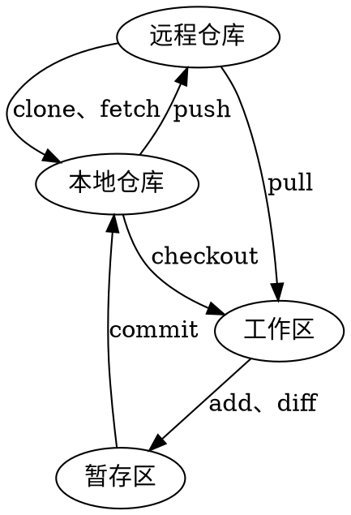

**[Home](../../Menu.md)**
作者：
[TOC]
# Git
## 介绍
### 工作区

### 暂存区

### 版本库

## token
### github生成token
1. 进入个人github账户setting
2. 点击Developer settings
3. 选择Personal access tokens
4. 点击 Generate new token
5. Note 为你创建的token添加描述
6. Expiration 选择token有效期时间。可以选择永不过期
7. 为token赋予权限。如果从命令行操作仓库，至少选中repo
8. 点击生成。生成之后先复制下来，后面会用到。注意：离开这个页面，之后你将看不见这个token的明文了。
### 使用token
```
$ vi .git/config
     url = https://<your_token>@github.com/<USERNAME>/<REPO>
    <your_token>：换成你自己得到的token
    <USERNAME>：是你自己github的用户名
    <REPO>：是你的仓库名称
```
### 工作流程

### 分支
* 创建 branch
* 切换 checkout
* 合并 merge

## 常用分支详解
### Master

### Develop

### Feature

### Release

### Hotfix


## Git 常用命令
### config
`git config user.name "Lu QingJuan"`
`git config user.email luqingjuan@cn.fujitsu.com`
`git config --list`

### remote
`git remote -v`

### clone

### branch

### checkout

### pull

### diff

### status

### add

### commit

### log

### push

### merge

### rebase

### cherry-pick

### fetch


## Git 关联命令
### diff
`diff -ruNa > test.patch`

### patch
* 插入差分
`patch -p1 < test.patch`
* 撤销差分
`patch -Rp1 < test.patch`


## 实操
1. 常规操作
* 使用git下载http://10.0.31.16上的Notes笔记
* 基于main分支创建个人分支
* 将自己的笔记，更新到个人分支


2. 解决冲突
在Debug分支完成以下操作：
* 分析并制造出一次同分支的conflict并解决
* git进行强制回退，此时应做哪些处理（以及项目组成员的沟通）


3. diff
在Debug分支，在工作区完成以下操作：
* 将最近两次的提交的内容，保存到diff文件中。
* 通过diff文件，还原到这两次的提交之前。
* 通过diff文件，将修改内容，修改会git库。


## 扩展
* git merge和cherry-pick的区别

* 不同库merge
1. 将repo1作为远程仓库，添加到repo2中，设置别名为other
`git remote add other ../repo1/`
2. 从repo1仓库中抓取数据到本仓库
`git fetch other`
3. 将repo1仓库抓去的master分支作为新分支checkout到本地，新分支名设定为repo1
`git checkout -b repo1 other/master`
4. 切换回repo2的master分支
`git checkout master`
5. 将repo1合并入master分支
`git merge repo1`

git checkout --theirs YOUR_BINARY_FILES // 保留需要合并进来的分支的修改
git checkout --ours YOUR_BINARY_FILES // 保留自己的修改


# 参考资料
