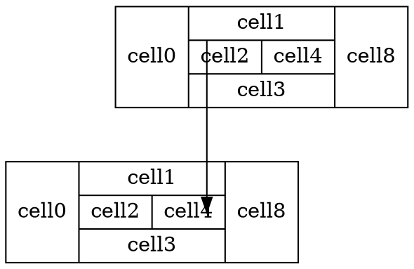

**[Home](../Menu.md)**
[TOC]
# MarkDown
## 软件安装配置
VSCode安装
打开 vscode 编辑器，在插件页搜索 markdown-preview-enhanced，接着点击 Install 按钮。
打开 vscode 编辑器，在插件页搜索 MarkdownMarkdown All in One，接着点击 Install 按钮。
打开 vscode 编辑器，在插件页搜索 Markmap，接着点击 Install 按钮。

`Ctrl`+`Shift`+`P`运行 Markdown Preview Enhanced: Extend Parser 命令。
编辑 parser.js 文件。
>支持特殊**注脚**和**跳转**和**标注**
```
  onWillParseMarkdown: function(markdown) {
    return new Promise((resolve, reject)=> {
      // 注脚
      // [name]@()  =>  `name`[^name]
      // markdown = markdown.replace(/\[([^\[\]@]+)\]@\(\)/gm, "<b>$1</b>[^$1]");
      // [name]@(id)  =>  `name`[^id]
      // markdown = markdown.replace(/\[([^\[\]@]+)\]@\(([^\(\)]+)\)/gm, "<b>$1</b>[^$2]");
      // [@name]:  =>  [^name]: `name`: 
      // markdown = markdown.replace(/\[@([^\[\]]+)\]:/gm, "[^$1]: `$1`: ");
      // 跳转
      // [出でる]#(9){jump_name}@{id} => <span id=id><b>`jump`</b></span>
      markdown = markdown.replace(/\[([^\[\]]+)\]#\(([^\(\)]+)\)/gm, "<span id=$2><b>`$1`</b></span>");
      // 标注
      // [name]^(detail)  =>  <ruby>name<rp>(</rp><rt>detail</rt><rp>)</rp></ruby>
      markdown = markdown.replace(/\[([^\^\[\]]+)\]\^\(([^\^\(\)]+)\)/gm, "<ruby>$1<rp>(</rp><rt>$2</rt><rp>)</rp></ruby>");

      //[[ ../Menu.md | Home #aaa ]]  =>  [Home](../Menu.md#aaa)
      markdown = markdown.replace(/\[\[ ([^ ]+) \| ([^ ]+) #([^ ]+) \]\]/gm, "[$2]($1#$3)");
      //# 课文 #aaaa  =>  # <span id=aaaa>课文</span>
      markdown = markdown.replace(/^(#+) ([^#\r\n]+) #([^\r\n]+)/gm, "$1 <span id=$3>$2</span>");
      //[[ ../Menu.md | Home ]]  =>  [Home](../Menu.md)
      markdown = markdown.replace(/\[\[ ([^ ]+) \| ([^ ]+) \]\]/gm, "[$2]($1)");

      //`@red:U-plane実施時以外`  =>  <font color="red">U-plane実施時以外</font>
      markdown = markdown.replace(/`@([a-z]+):([^`]+)`/gm, "<font color=\"$1\">$2</font>");

      return resolve(markdown)
    })
  },
```

# 文本语法
## 注释
`[comment]:注释`

[comment]:表格快速格式化:`Shift`+`Alt`+`F`
## 文本格式
>小作文1
~~删除~~
==黄色高亮==
<font color="red">红色</font>
**加粗**
*倾斜*
>小作文2

`@red:红色`
`@blue:蓝色`
`@gree:绿色`

---
***

## 列表
1. 方式一
    - ddd
    - aaa
2. 方式二
    * aaa
    * bbb

## 表格
| 序号     | 信息 |
| -------- | ---- |
| [ 1](#1) |      |
| [ 2](#2) |      |
| [ 3](#3) |      |
| [ 4](#4) |      |
PS:表格快速格式化:`Shift`+`Alt`+`F`

## 清单
- [ ] Todo
- [x] Done

## 引用
### 代码
`代码段`

```C
int main()
{
    printf("hell word!\n");
    return 0;
}
```

### md
@import "MarkdownImport.md"

### 图片


### 链接
[文件链接](../src/test.pdf)
[网站链接](https://www.baidu.com/)

# 其他语法
## 标注
**普通**
<ruby>菜<rp>(</rp><rt>cai</rt><rp>)</rp></ruby>
X^2^
X~0~

**特殊**
[菜]^(cai)

## 注脚
**普通**
注释信息1[^1]
[^1]:`注释信息1`:sss

**特殊**
www[注释信息]@(2)
[@2]:`ww`:wwww

eeeewww[name]@()www
[@name]:[生]^(なま)[臭]^(ぐさ)い（3）腥的


## 跳转
**普通**
[跳转 去往](#1)
* * *
<span id=1><b>跳转 到达</b></span>

**特殊**
[跳转 去往](#9)
* * *
[跳转 到达]#(9)

## 文本折叠
><details><summary>详解</summary>
>
>**答案**：1
**中文**：山田导演的“我，山田，时隔50年回到了故乡。”的致辞起会场响起热烈的掌声。
**日文**：山田監督の、「私、山田は、50年ぶりにふるさとに戻ってまいりました。」というあいさつに、会場からは大きな拍手が起こった。
**解析**：
</details>

## 双向跳转
<span id=2_2>[去往](#2_1)</span>
* * *
<span id=2_1>[返回](#2_2)</span>

## 文件跳转
[MarkdownImport.md Tag 链接](MarkdownImport.md#9)

## 括号
**左大括号 +{**
>$＋\left\{\begin{matrix}111 \\222 \\333 \\444 \end{matrix}\right.$

**右大括号 }+**
>$\left.\begin{matrix}111 \\222 \\333 \\444 \end{matrix}\right\}＋$

**右左大括号 }++{**
>$\left.\begin{matrix}111 \\222 \\333 \\444 \end{matrix}\right\}＋＋\left\{\begin{matrix}11 \\22 \\33 \\44 \end{matrix}\right.$

**左右大括号 +{}+**
>$＋\left\{\begin{matrix}111 \\222 \\333 \\444 \end{matrix}\right\}＋$

## [图 Mermaid](https://blog.csdn.net/qq_32708605/article/details/123801702)
[知乎 入门到如土](https://zhuanlan.zhihu.com/p/355997933)
[github](https://github.com/mermaid-js/mermaid)
[官网](https://mermaid.js.org/intro/)

* [Flowchart](https://mermaid.js.org/syntax/flowchart.html)
* [Sequence Diagram](https://mermaid.js.org/syntax/sequenceDiagram.html)
* [Class Diagram](https://mermaid.js.org/syntax/classDiagram.html)
* [State Diagram](https://mermaid.js.org/syntax/stateDiagram.html)
* [Entity Relationship Diagram](https://mermaid.js.org/syntax/entityRelationshipDiagram.html)
* [User Journey](https://mermaid.js.org/syntax/userJourney.html)
* [Gantt](https://mermaid.js.org/syntax/gantt.html)
* [Pie Chart](https://mermaid.js.org/syntax/pie.html)
* [Requirement Diagram](https://mermaid.js.org/syntax/requirementDiagram.html)
* [Gitgraph (Git) Diagram](https://mermaid.js.org/syntax/gitgraph.html)
* [C4C Diagram (Context) Diagram](https://mermaid.js.org/syntax/c4c.html)
* [Mindmaps](https://mermaid.js.org/syntax/mindmaps.html)
* [Other Examples](https://mermaid.js.org/syntax/examples.html)

### [（）]()
```mermaid
```

## 图 Graphviz
```graphviz
digraph demo{
  graph[]
/*
bgcolor:设置图的背景颜色，可以使用red、blue、green等形式，或者使用"#rrggbb"形式。
label:设置图的描述。label会继承到子图，子图里如果不想重复显示必须手动设置
rankdir:设置图的方向，包括:TB（top to bottom）、BT（bottom to top）、LR（left to right）、RL（right to left）。
rotate:设置图的旋转。如:rotate = 90便是逆时针旋转90度。
ratio:设置图的长宽比，可以是一个浮点数，也可以是:fill、compress或者auto。
*/
  node[]
/*
  shape:设置结点形状。包括:Mrecord（圆角矩形）、record（矩形）、circle（圆形）、box（矩形，和record略有区别，下面会讲到）、egg（蛋形）、doublecircle（双圆形）、plaintext（纯文本）、 ellipse（椭圆，默认）。
  label:设置结点的显示内容，内容用双引号包含，可以使用转义字符。当结点内容!=结点名时使用
  style:设置结点的样式。包括:filled(填充)、dotted（点状边框）、solid（普通边框）、dashed（虚线边框）、bold（边框加粗）、invis（隐形）。
  color:设置边框颜色。可以使用单词形式或者"#rrggbb"形式。
  fillcolor:设置填充颜色，仅style = filled时有效。
  width:设置结点宽度。
  height:设置结点高度。
  peripheries:设置结点边框个数。
  fontcolor:设置结点内容颜色。可以使用单词形式或者"#rrggbb"形式。
  需要重点强调的是:
  如果设置了style = filled，此时设置的color是代表整体颜色。
  但是如果设置了fillcolor再设置color的话，color代表边框颜色。 
*/
  edge[]
/*
  style:设置边的形状。包括:solid（实线）、dashed（虚线）、dotted（点线）、bold（加粗）、invis（隐形）。
  label:设置边标签。内容用双引号包含，可以使用转义字符。
  color:设置边颜色。可以使用单词形式或者"#rrggbb"形式。
  arrowhead:设置结点箭头样式。包括:none、empty、odiamond等。
  splines 控制如何以及是否表示边缘。其值如下
    none 或者 “”, 无边
    true 或者 spline, 样条线（无规则，可为直或者曲线）
    false 或者 line, 直线段
    polyline, 折线
    curved, 曲弧线，两条
    ortho, 正直的线（横竖）
dir 设置绘制箭头的边缘类型
dir both];
    B->C[dir=none];
    C->D[label=aaa, dir=back];
    D->A[dir=forward];
*/

    A[label="AAA"]
    A->B[dir=both];
    B->C[dir=none];
    C->D[label=aaa, dir=back];
    D->A[dir=forward];
}
```



### dot 转图形工具（Graphviz）
<b>参考</b>
* 能一边写一边看图的在线网站[graphviz Online](http://dreampuf.github.io/GraphvizOnline/#digraph%20G%20%7B%0A%0A%20%20subgraph%20cluster_0%20%7B%0A%20%20%20%20style%3Dfilled%3B%0A%20%20%20%20color%3Dlightgrey%3B%0A%20%20%20%20node%20%5Bstyle%3Dfilled%2Ccolor%3Dwhite%5D%3B%0A%20%20%20%20a0%20-%3E%20a1%20-%3E%20a2%20-%3E%20a3%3B%0A%20%20%20%20label%20%3D%20%22process%20%231%22%3B%0A%20%20%7D%0A%0A%20%20subgraph%20cluster_1%20%7B%0A%20%20%20%20node%20%5Bstyle%3Dfilled%5D%3B%0A%20%20%20%20b0%20-%3E%20b1%20-%3E%20b2%20-%3E%20b3%3B%0A%20%20%20%20label%20%3D%20%22process%20%232%22%3B%0A%20%20%20%20color%3Dblue%0A%20%20%7D%0A%20%20start%20-%3E%20a0%3B%0A%20%20start%20-%3E%20b0%3B%0A%20%20a1%20-%3E%20b3%3B%0A%20%20b2%20-%3E%20a3%3B%0A%20%20a3%20-%3E%20a0%3B%0A%20%20a3%20-%3E%20end%3B%0A%20%20b3%20-%3E%20end%3B%0A%0A%20%20start%20%5Bshape%3DMdiamond%5D%3B%0A%20%20end%20%5Bshape%3DMsquare%5D%3B%0A%7D)
* [Dot脚本语言语法整理](https://blog.csdn.net/jy692405180/article/details/52077979)
* [Graphviz | Dot画图脚本语言学习](https://blog.csdn.net/qq_44994842/article/details/109677364?spm=1001.2101.3001.6650.16&utm_medium=distribute.pc_relevant.none-task-blog-2%7Edefault%7EBlogCommendFromBaidu%7Edefault-16-109677364-blog-52077979.pc_relevant_default&depth_1-utm_source=distribute.pc_relevant.none-task-blog-2%7Edefault%7EBlogCommendFromBaidu%7Edefault-16-109677364-blog-52077979.pc_relevant_default&utm_relevant_index=23)

## 流程 Flow
```flow
st=>start: 开始
op=>operation: My Operation
cond=>condition: Yes or No?
e=>end
st->op->cond
cond(yes)->e
cond(no)->op
&
```
---
# 参考
[教程向: 在 VS Code 中用 Markdown 做「数字化」学习笔记](https://zhuanlan.zhihu.com/p/366596107)
[Markdown编辑器快捷键](https://blog.csdn.net/CRW__DREAM/article/details/123085465)