* 语句末尾分号是可选的。%% 行注释。

## 流程图

### 方向：
* TB/TD - top bottom
* BT - bottom top
* RL - right left
* LR - left right
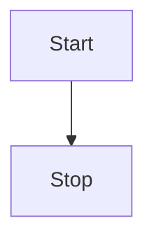
### 节点
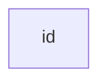
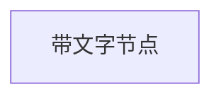

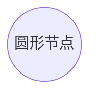

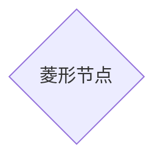
### 连接线
* 实线，箭头，无文字

* 实线，无箭头，无文字
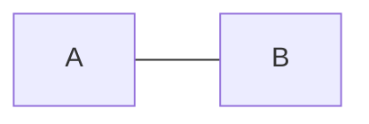
* 实线，无箭头，文字
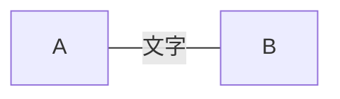
或

* 实线，箭头，文字
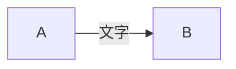
或

* 虚线，箭头，无文字
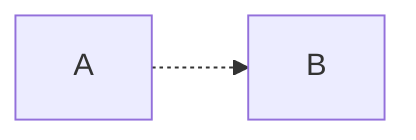
* 虚线，箭头，文字
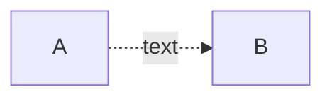
* 大箭头，无文字
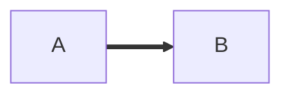
* 大箭头，文字
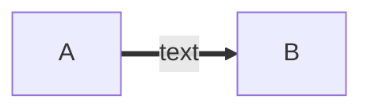
### 特殊语法
#### 引号
文字里用引号避免一些特殊字符的错误。比如矩形节点里有 () 时就无法渲染，所以加上引号。
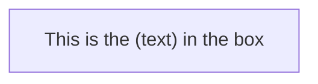
#### 实体字符
可以使用 HTML 中的实体字符。
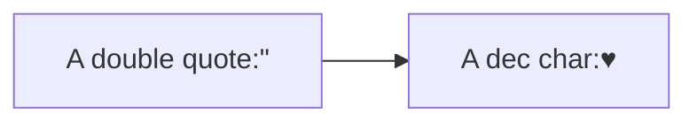
### 子图
```mermaid
graph TB
    c1-->a2
    subgraph one
        a1-->a2
    end
    subgraph two
        b1-->b2
    end
    subgraph three
        c1-->c2
    end
```
### 样式
* linkStyle 后面的数字表示第几根线，从 0 开始。可以指定颜色和粗细。

```mermaid
graph TD;
    A-->B;
    A-->C;
    B-->D;
    C-->D;
    linkStyle 0 stroke:#0ff,stroke-width:2px;
    linkStyle 3 stroke:#ff3,stroke-width:4px;
```
* 可以设置节点背景，边框颜色，粗细，实线还是虚线

```mermaid
graph LR
    id1(Start)-->id2(Stop)
    style id1 fill:#f9f,stroke:#333,stroke-width:4px
    style id2 fill:#ccf,stroke:#f66,stroke-width:2px,stroke-dasharray: 5, 5
```
#### 样式类
```mermaid
graph LR
    A-->B

    %% 定义样式类
    classDef className fill:#f9f,stroke:#333,stroke-width:4px;

    %% 应用样式类，markdown里没效果
    class A className
classDef default fill:#f9f,stroke:#333,stroke-width:4px;
```
定义一个名为 default 的类，节点没有指定特定样式类时，将都会应用这个样式类。

### 图标
可以使用 Font Awesome 图标。语法 fa:icon class name。
```mermaid
graph TD
   B["fa:fa-twitter for peace"]
   B-->C[fa:fa-ban forbidden]
   B-->D(fa:fa-spinner);
   B-->E(A fa:fa-camera-retro perhaps?);
```
## 时序图
```mermaid
sequenceDiagram
    participant Alice
    participant Bob
    Alice->John: Hello John, how are you?
    loop Healthcheck
        John->John: Fight against hypochondria
    end
    Note right of John: Rational thoughts <br/>prevail...
    John-->Alice: Great!
    John->Bob: How about you?
    Bob-->John: Jolly good!
```
参与者
如果不显示声明，参与者将根据第一次出现的顺序排列，如：

sequenceDiagram
    Alice->>John: Hello John, how are you?
    John-->>Alice: Great!
第一条语句出现了两个参与者角色，而在这条语句中，Alice 在 John 之前，所以图中也是这个顺序。如果不想根据第一次出现的顺序来排，可以主动声明以定义顺序：

sequenceDiagram
    participant John
    participant Alice
    Alice->>John: Hello John, how are you?
    John-->>Alice: Great!
别名
可以给角色写一个简短的别名以方便书写。

sequenceDiagram
    participant A as Alice
    participant J as John
    A->>J: Hello John, how are you?
    J->>A: Great!
消息
消息连线有六种样式。

有一个-是实线，两个-是虚线。

sequenceDiagram
    A->B: 无箭头实线
    A-->B: 无箭头虚线(点线)
    A->>B: 有箭头实线
    A-->>B: 有箭头实线
    A-x B: 有箭头实线，加上叉
    A--x B: 有箭头虚线，加上叉
活动期
sequenceDiagram
    Alice->>John: Hello John, how are you?
    %% activate 角色名 表示激活控制焦点
    activate John
    John-->>Alice: Great!
    %% deactivate 角色名 表示控制焦点结束
    deactivate John
使用 +/- 的更方便的写法：

sequenceDiagram
    Alice->>+John: Hello John, how are you?
    John-->>-Alice: Great!
可以嵌套：

sequenceDiagram
    Alice->>+John: Hello John, how are you?
    Alice->>+John: John, can you hear me?
    John-->>-Alice: Hi Alice, I can hear you!
    John-->>-Alice: I feel great!
备注
语法：Note [ right of | left of | over ] [Actor]。

sequenceDiagram
    participant John
    Note right of John: Text in note
over 可用于单独一个角色上，也可以用于相邻两个角色间：

sequenceDiagram
    Alice->John: Hello John, how are you?
    Note over Alice,John: A typical interaction
循环
语法：

loop Loop text
... statements ...
end
sequenceDiagram
    Alice->John: Hello John, how are you?
    %% loop 后跟循环体说明文字
    loop Every minute
        John-->Alice: Great!
    %% 标记循环结束
    end
选择
语法：

alt Describing text
... statements ...
else
... statements ...
end
可选条件，比如在没有 else 分支的情况下使用，有点类似 java 中的 switch 的 default 分支，代表剩下所有情况。

opt Describing text
... statements ...
end
sequenceDiagram
    Alice->>Bob: Hello Bob, how are you?
    alt is sick
        Bob->>Alice: Not so good :(
    else is well
        Bob->>Alice: Feeling fresh like a daisy
    end
    opt Extra response
        Bob->>Alice: Thanks for asking
    end