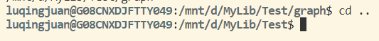

**[Home](../../Menu.md)**
作者：
[TOC]

# Linux系统
## 文件系统
### 目录树结构
>TODO
### 特殊文件
* 软链接
  * 介绍
    >TODO
  * 基本操作
    * 创建
        >TODO
    * 删除
        >TODO
* 硬链接
  >同上

* 两者之间的什么区别
>TODO

## 命令
### 万能命令
#### man
* 介绍：
* 语法：`man [选项] [参数]`
* 选项：
* 参数：
* 常用参数搭配：
>TODO
#### yum
>TODO

#### 实操
* 安装 git
  1. 
  2. 
  3. 
  4. 查看git版本：
* 卸载 git

### 文件操作相关
#### cd
* 介绍：跳转到某个文件夹下。
* 语法：`cd [目录名]`
* 常用参数搭配：

| 命令  | 说明         |
| ----- | ------------ |
| cd .. | 跳转到上一级 |
|       |              |
|       |              |
|       |              |
PS:表格快速格式化:`Shift`+`Alt`+`F`

* 练习记录

>TODO
#### pwd
>TODO
#### ls
>TODO
#### mkdir
>TODO
#### cat
>TODO
#### tail
>TODO
#### head
>TODO
#### mv
>TODO
#### cp
>TODO
#### rm
>TODO
### 其他命令
#### tar
>TODO
#### ssh
>TODO
#### scp
>TODO
#### 实操
* 任务书，上传文件到Linux服务器，压缩成Task1.tar.gz文件，将Task1.tar.gz文件下载到本地

* Linux环境，解压Task1.tar.gz文件

### 系统资源命令
#### TODO
* 介绍：查看磁盘空间信息
>TODO
#### TODO
* 介绍：查看内存信息
>TODO
#### TODO
* 介绍：查看网卡信息
>TODO
#### TODO
* 介绍：查看进程信息
>TODO
## 快捷键（Ctrl组合键）
| 命令          | 说明 |
| ------------- | ---- |
| `Ctrl`+`C` .. | 清屏 |
|               |      |
|               |      |
|               |      |
|               |      |
|               |      |
ps:表格快速格式化:`Shift`+`Alt`+`F`

# 参考资料