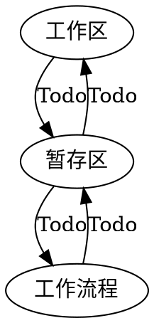
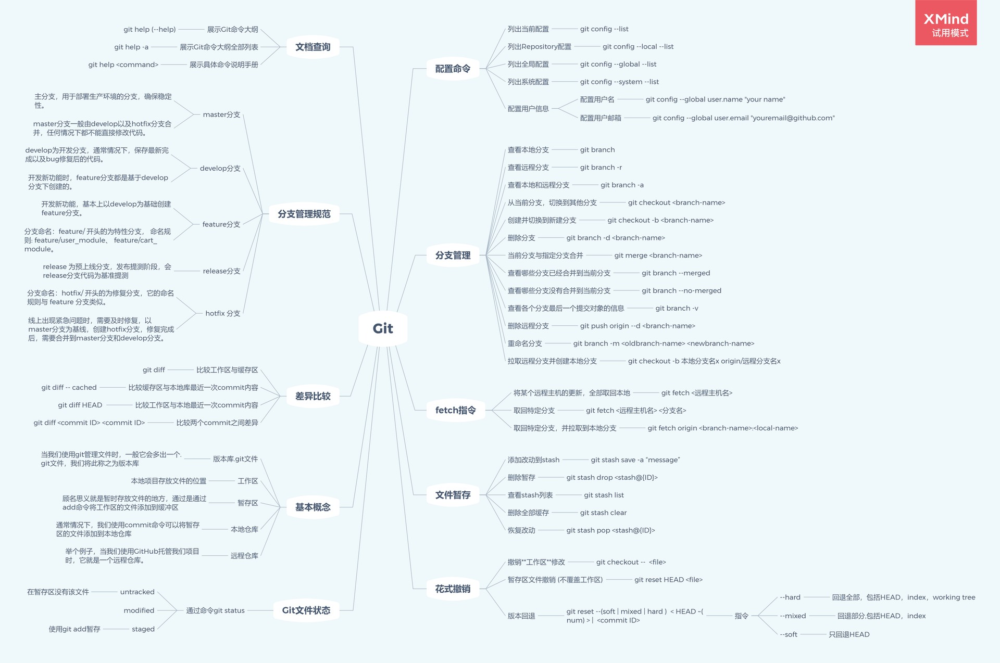

**[Home](../../Menu.md)**
作者：
[TOC]
# Git

## 介绍
### 工作区
>TODO
### 暂存区
>TODO
### 版本库
>TODO
### 工作流程
>TODO

## 常用分支详解
### Master
>TODO
### Develop
>TODO
### Feature
>TODO
### Release
>TODO
### Hotfix
>TODO

## Git 常用命令
### clone
>TODO
### branch
>TODO
### checkout
>TODO
### pull
>TODO
### diff
>TODO
### add
>TODO
### commit
>TODO
### push
>TODO
### merge
>TODO
### rebase
>TODO
### cherry-pick
>TODO
### fetch
>TODO

## Git 关联命令
### patch
>TODO

## 实操
1. 常规操作
* 使用git下载http://10.0.31.16上的Notes笔记
* 基于main分支创建个人分支
* 将自己的笔记，更新到个人分支
>TODO

2. 解决冲突
在Debug分支完成以下操作：
* 分析并制造出一次同分支的conflict并解决
* git进行强制回退，此时应做哪些处理（以及项目组成员的沟通）
>TODO

3. diff
在Debug分支，在工作区完成以下操作：
* 将最近两次的提交的内容，保存到diff文件中。
* 通过diff文件，还原到这两次的提交之前。
* 通过diff文件，将修改内容，修改会git库。
>TODO

## 扩展
* git merge和cherry-pick的区别
>TODO

# 参考资料
