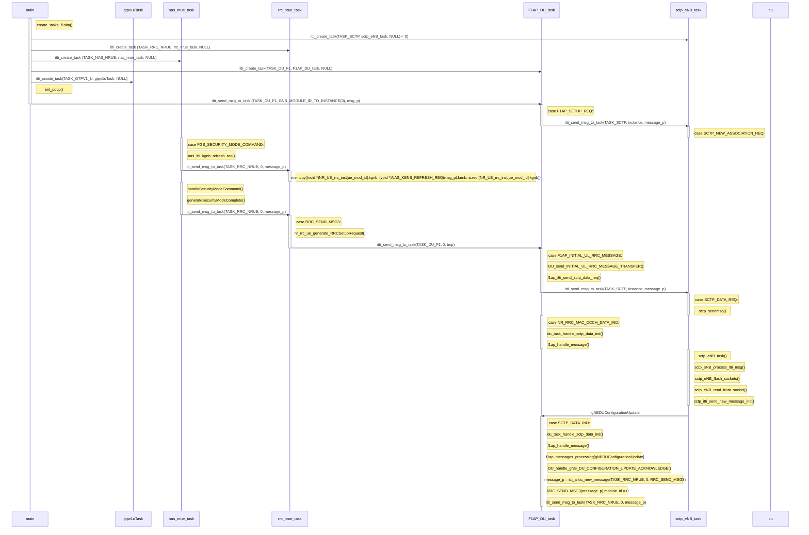

[Wiki](http://10.167.14.30:8081/gitlab/training/mtc-oai/wikis/OAI-CU-F1SIM)
                                                              |
| ------- | --------------------------- | --------------------------------------------------- | ----------------------------------------------------------------------------------------------------------------------------------------------------------------------------------------------------------- |
| free5gc |                             |                                                     | 查看AMF_IP：docker inspect amf                                                                                                                                                                              |
| CU      | docker exec -it oai-cu bash | cd /home/jftt/work_jftt/yinc/oai5g_sa/cmake_targets | [ 编译 ] ./build_oai --gNB --nrUE -x -c -w None [ 运行 ] ./ran_build/build/nr-softmodem --sa -O cu_gnb.conf --log_config.global_log_options level,nocolor,time                                           |
| f1sim   | docker exec -it f1sim bash  | cd /home/jftt/work_jftt/yinc/oai5g_sa/cmake_targets | [ 编译 ] ./build_oai -x -w None --F1SIM --build-lib telnetsrv -c [ 运行 ] ./ran_build/build/nr-f1sim -O du_gnb.1cell.conf --sa --nokrnmod --telnetsrv --log_config.global_log_options level,nocolor,time |
|         |                             |                                                     |

### 29环境
环境: CU + F1SIM + FREE5GC
  10.167.14.29
**0. free5gc**
  * [ 配置文件 ]
    * 完整性保护
      有`NIA2`
      无`NIA0`
  * [ 打开 ]
    > docker-compose -f docker-compose-build.yaml up
  * [ 关闭 ] 
    > docker-compose -f docker-compose-build.yaml down

**1. CU: http://10.37.190.73:5080/oai5g_community/oai5g_sa.git       branch: cu_configuring_multiple_cells**
  * [ 查看AMF_IP ] 
     >  docker inspect amf
  * [ 进入CU container ]  
    >  docker exec -it oai-cu bash  
  * [ 配置文件修改 ] 
    * >   vi /oai-ran/cmake_targets/cu_gnb.conf
    * >   amf_ip_address      = ( { ipv4       = "`AMF_IP`"; 
  * [ 编译 ]
    >  ./build_oai --gNB --nrUE -x -c -w None 
 * [ 运行 ] 
    >  ./ran_build/build/nr-softmodem --sa -O cu_gnb.conf --log_config.global_log_options level,nocolor,time

**2. F1SIM: http://10.37.190.73:5080/oai5g_community/oai5g_sa.git       branch: radisys_3cell_para**  
  * [ 进入F1SIM container ] 
    > docker exec -it f1sim bash 
  * [ 编译 ]  
    > ./build_oai -x -w None --F1SIM --build-lib telnetsrv -c 
  * [ 运行 ]  
    > ./ran_build/build/nr-f1sim -O du_gnb.1cell.conf --sa --nokrnmod --telnetsrv --log_config.global_log_options level,nocolor,time 

**3. ping:**
  *  [ 查看UPF_IP ]
     >  docker inspect upf
  * [ UE侧 ]  
    >  ping `UPF_IP` -I oaitun_ue1 -c 10

**4. iperf:**
  *  [ 进入UPF container ]
     >  docker exec -it upf bash
  *  [ 安装依赖包]
     >  apt-get install inetutils-ping iperf
  * [ 执行upf脚本 ]
     >  ./upf-iptables.sh
  * [ DL ]
    * [ UE ]
      >  iperf -s -u -i 1 -B `ue_ip` -p 5001
    * [ UPF ]
      >  iperf -u -t 10 -i 1 -p 5001 -c `ue_ip` -B `UPF_IP` -b 12M
  * [ UL ]
    * [ UPF ]
      > UPF: iperf -s -u -i 1 -B `UPF_IP` -p 5001  
    * [ UE ]
      >  iperf -u -t 10 -i 1 -p 5001 -c `UPF_IP` -B `ue_ip` -b 17M
## 32 环境
10.167.14.32环境
free5gc:
>cd /home/jftt/work_jftt/xues/free5gc-compose

cu:
>cd /home/jftt/work_jftt/lu/oai5g_cu/cmake_targets

f1sim:
>cd /home/jftt/work_jftt/lu/oai5g_sa/cmake_targets

环境: CU + F1SIM + FREE5GC
  10.167.14.29
**0. free5gc**
  * [ 配置文件 ]
    * 完整性保护
      有`NIA2`
      无`NIA0`
  * [ 打开 ]
    > docker-compose -f docker-compose-build.yaml up
  * [ 关闭 ] 
    > docker-compose -f docker-compose-build.yaml down

**1. CU: http://10.37.190.73:5080/oai5g_community/oai5g_sa.git       branch: cu_configuring_multiple_cells**
  * [ 查看AMF_IP ] 
     >  docker inspect amf
  * [ 配置文件修改 ] 
    * >   vi cu_gnb.conf
    * >   amf_ip_address      = ( { ipv4       = "`AMF_IP`"; 
  * [ 编译 ]
    >  sudo -E ./build_oai --gNB --nrUE -x -c -w None 
 * [ 运行 ] 
    >  sudo -E ./ran_build/build/nr-softmodem --sa -O cu_gnb.conf --log_config.global_log_options level,time,nocolor

**2. F1SIM: http://10.37.190.73:5080/oai5g_community/oai5g_sa.git       branch: radisys_3cell_para**
  * [ 编译 ]  
    > sudo -E ./build_oai -x -w None --F1SIM --build-lib telnetsrv -c 
  * [ 运行 ]  
    > sudo -E ./ran_build/build/nr-f1sim -O du_gnb.1cell.conf --sa --nokrnmod --telnetsrv --log_config.global_log_options level,time --num-ues 2
,nocolor

>sudo tcpdump -i br-free5gc -w 5gc_dump.pcap
>$ sudo tcpdump -i lo: -w du.pcap

1 UE 0.44592500
70	2023-06-02 22:27:07.697411	10.100.200.1	10.100.200.8	NGAP/NAS-5GS	146	InitialUEMessage, Registration request
204	2023-06-02 22:27:07.703248	10.100.200.8	10.100.200.1	NGAP/NAS-5GS	150	DownlinkNASTransport, Authentication request
207	2023-06-02 22:27:07.703896	10.100.200.1	10.100.200.8	NGAP/NAS-5GS	146	UplinkNASTransport, Authentication response
268	2023-06-02 22:27:07.706092	10.100.200.8	10.100.200.1	NGAP/NAS-5GS	134	DownlinkNASTransport, Security mode command
269	2023-06-02 22:27:07.706365	10.100.200.1	10.100.200.8	NGAP/NAS-5GS	178	UplinkNASTransport
553	2023-06-02 22:27:07.717754	10.100.200.8	10.100.200.1	NGAP/NAS-5GS	258	InitialContextSetupRequest
558	2023-06-02 22:27:07.718339	10.100.200.1	10.100.200.8	NGAP	538	UERadioCapabilityInfoIndication
562	2023-06-02 22:27:07.921141	10.100.200.1	10.100.200.8	NGAP	86	InitialContextSetupResponse
564	2023-06-02 22:27:08.125113	10.100.200.1	10.100.200.8	NGAP/NAS-5GS	226	UplinkNASTransport
876	2023-06-02 22:27:08.140587	10.100.200.8	10.100.200.1	NGAP/NAS-5GS	250	PDUSessionResourceSetupRequest
883	2023-06-02 22:27:08.143336	10.100.200.1	10.100.200.8	NGAP	122	PDUSessionResourceSetupResponse

50 UE 5.60426300
13		2023-06-02 22:32:57.296905	10.100.200.1	10.100.200.8	NGAP/NAS-5GS	146	InitialUEMessage, Registration request
46265	2023-06-02 22:33:02.901168	10.100.200.1	10.100.200.8	NGAP	106	PDUSessionResourceSetupResponse

100 UE 10.84294500
13		2023-06-02 22:24:09.702239	10.100.200.1	10.100.200.8	NGAP/NAS-5GS	146	InitialUEMessage, Registration request
92511	2023-06-02 22:24:20.545184	10.100.200.1	10.100.200.8	NGAP	106	PDUSessionResourceSetupResponse

main                                             executables\nr-f1sim.c
    create_tasks_f1sim
        nas_nrue_task
        if(next_Mod_id < (ue_count -1))          openair3\NAS\NR_UE\nr_nas_msg_sim.c
            nr_ue_rrc_trigger_msg3

check_nr_prach
nr_ue_prach_procedures
    nr_ue_get_rach

    nr_decode_SI

    nr_rrc_ue_generate_ra_msg

    nr_rrc_ue_decode_NR_BCCH_DL_SCH_Message
        nr_rrc_ue_generate_RRCSetupRequest
            do_RRCSetupRequest "RRCSetupRequest Encoded "

nas_itti_kgnb_refresh_req(ue_security_key[Mod_id]->kgnb, instance);
handleSecurityModeCommond(Mod_id, pdu_buffer, NAS_DOWNLINK_DATA_IND(msg_p).nasMsg.length);
generateSecurityModeComplete(Mod_id,&initialNasMsg);

generateSecurityModeComplete
generateRegistrationComplete
generatePduSessionEstablishRequest
generateDeregistrationRequest

nas_message_get_mac
    nas_stream_encrypt_eia2

handleSecurityModeCommond