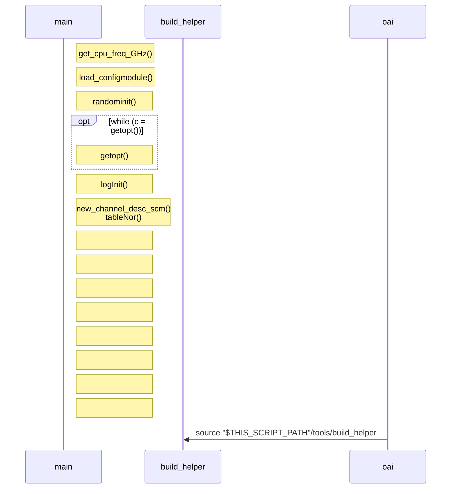

## dlschsim
### load_configmodule()

```mermaid
  sequenceDiagram
    Note right of main      :  get_cpu_freq_GHz()
    Note right of main      :  load_configmodule()
    Note right of main      :  randominit()
    opt while (c = getopt())
      Note right of main    :  getopt()
    end
    Note right of main      :  logInit()
    Note right of main      :  new_channel_desc_scm()<br>  tableNor()
    Note right of main      : 
    Note right of main      : 
    Note right of main      : 
    Note right of main      : 
    Note right of main      : 
    Note right of main      : 
    Note right of main      : 
    Note right of main      : 
    participant help as build_helper
    oai->>help:source "$THIS_SCRIPT_PATH"/tools/build_helper
```