#### dlschsim
下行共享信道（DL-SCH，Downlink Shared CHannel） 该信道使用 HARQ 传输，能够调整传输使用的调制方式/编码速率和发送功率来实现链 路自适应
##### 编译
```
source oaienv 
cd openairinterface5g/cmake_targets/
./build_oai --phy_simulators
```

##### CI
```
cd cmake_targets/autotests
sudo -E ./run_exec_autotests.bash -c test_case_list.xml

cat cmake_targets/autotests/log/results_autotests.xml
```

##### 手动运行
```
cd cmake_targets/ran_build/build/
./nr_dlschsim -R 106 -m9 -s13 -n100
./nr_dlschsim -R 217 -m15 -s15 -n100
./nr_dlschsim -R 273 -m19 -s20 -n100
```

##### 参数说明
`./nr_dlschsim -h(elp) -p(extended_prefix) -N cell_id -f output_filename -F input_filename -g channel_model -n n_frames -t Delayspread -s snr0 -S snr1  -y TXant -z RXant -i Intefrence0 -j Interference1 -A interpolation_file -C(alibration offset dB) -N CellId`
|     | 参数 | 默认值         |                                                                                                                                                 | 说明                                                                                                                 |
| --- | ---- | -------------- | ----------------------------------------------------------------------------------------------------------------------------------------------- | -------------------------------------------------------------------------------------------------------------------- |
|     | -h   |                | 帮助文档                                                                                                                                        | This message                                                                                                         |
| @   | -d   | 0              | dlsch线程数<br>0：无dlsch并行化                                                                                                                   | number of dlsch threads, 0: no dlsch parallelization                                                                 |
| @   | -g   | AWGN           | 'A': SCM_A<br>'B': SCM_B<br>'C': SCM_C<br>'D': SCM_D<br>'E': E-EPA<br>'F': F-EVA<br>'G': G-ETU（忽略延迟扩展和Ricean因子）                      | [A,B,C,D,E,F,G] Use 3GPP SCM (A,B,C,D) or 36-101 (E-EPA,F-EVA,G-ETU) models (ignores delay spread and Ricean factor) |
| @   | -n   | 1              | 要模拟的帧数                                                                                                                                    | Number of frames to simulate                                                                                         |
| @   | -s   | -2.0           | 起始SNR，从SNR0运行到SNR0+5dB<br>如果n_frames为1，则仅模拟SNR                                                                                     | Starting SNR, runs from SNR0 to SNR0 + 5 dB.  If n_frames is 1 then just SNR is simulated                            |
| @   | -V   | false(0)       | 启用VCD静音功能                                                                                                                                 | Enable VCD dumb functions                                                                                            |
| @   | -S   | 2.0            | 结束SNR，从SNR0运行到SNR1                                                                                                                       | Ending SNR, runs from SNR0 to SNR1                                                                                   |
| @   | -p   | false(0)       | 使用扩展前缀模式                                                                                                                                | Use extended prefix mode                                                                                             |
| @   | -y   | 1              | eNB中使用的TX天线数量                                                                                                                           | Number of TX antennas used in eNB                                                                                    |
| @   | -z   | 1              | UE中使用的RX天线数量                                                                                                                            | Number of RX antennas used in UE                                                                                     |
| @   | -M   | 0x01           | 突发中的多个SSB位置                                                                                                                             | Multiple SSB positions in burst                                                                                      |
| @   | -N   | 0              | LTE 一共定义了504 个不同的PCI（即NIDcell，取值范围0 ~ 503）                                                                                     | Nid_cell                                                                                                             |
| @   | -R   | 106            | N_RB_DL                                                                                                                                         | N_RB_DL                                                                                                              |
| @   | -F   | NULL           | RX一致性测试的输入文件名（.txt格式）                                                                                                            | Input filename (.txt format) for RX conformance testing                                                              |
| ?   | -P   | 0              | PBCH phase (0-3)                                                                                                                                |
| ?   | -L   | OAILOG_WARNING | OAILOG_DISABLE -1<br>OAILOG_ERR      0<br>OAILOG_WARNING  1<br>OAILOG_ANALYSIS 2<br>OAILOG_INFO     3<br>OAILOG_DEBUG    4<br>OAILOG_TRACE    5 | loglvl                                                                                                               |
| ?   | -m   | 9              | Imcs                                                                                                                                            | Imcs                                                                                                                 |
| ?   | -l   | 12             |                                                                                                                                                 | nb_symb_sch                                                                                                          |
| ?   | -r   | 50             |                                                                                                                                                 | nb_rb                                                                                                                |
| ?   | -X   | ???            |                                                                                                                                                 | strncpy(gNBthreads, optarg, sizeof(gNBthreads)-1);<br>gNBthreads[sizeof(gNBthreads)-1]=0;                            |

##### 代码解析
###### dlschsim

```mermaid
    sequenceDiagram
    participant vcd_dumper_thread_rt as VDC
%%main
activate main
Note over main :                                cpuf = get_cpu_freq_GHz()
Note over main :                                load_configmodule(argc, argv, CONFIG_ENABLECMDLINEONLY)
                                                alt if ( ret == 0)
Note over main :                                    exit_fun("[NR_DLSCHSIM] Error, configuration module init failed\n")
                                                end
Note over main :                                randominit(0)<br>通过调用tableNor()函数，初始化gaussZiggurat RNG<br>随机为kn,wn,fn创建表格
Note over main :                                --------------------------------------根据获取的参数，对进行设置--------------------------------------
Note over main :                                c = getopt(argc, argv, "df:hpVg:i:j:n:l:m:r:s:S:y:z:M:N:F:R:P:L:X:")
                                                loop while (c != -1)
                                                    alt c is 'd'
Note over main :                                        dlsch_threads = atoi(optarg)
                                                    else c is 'g'
                                                        alt optarg is 'A'
Note over main :                                            channel_model = SCM_A
                                                        else optarg is 'B'
Note over main :                                            channel_model = SCM_B
                                                        else optarg is 'C'
Note over main :                                            channel_model = SCM_C
                                                        else optarg is 'D'
Note over main :                                            channel_model = SCM_D
                                                        else optarg is 'E'
Note over main :                                            channel_model = EPA
                                                        else optarg is 'F'
Note over main :                                            channel_model = EVA
                                                        else optarg is 'G'
Note over main :                                            channel_model = ETU
                                                        end
                                                        opt Extra response
Note over main :                                            exit(-1)
                                                        end
                                                    else c is 'n'
Note over main :                                        n_trials = atoi(optarg)
                                                    else c is 's'
Note over main :                                        snr0 = atof(optarg)
                                                    else c is 'V'
Note over main :                                        ouput_vcd = 1
                                                    else c is 'S'
Note over main :                                        snr1 = atof(optarg)
Note over main :                                        snr1set = 1
                                                    else c is 'p'
Note over main :                                        extended_prefix_flag = 1
                                                    else c is 'y'
Note over main :                                        n_tx = atoi(optarg)//(1,2)
                                                        alt if ((n_tx == 0) || (n_tx > 2))
Note over main :                                            exit(-1)
                                                        end
                                                    else c is 'z'
Note over main :                                        n_rx = atoi(optarg)//(1,2)
                                                        alt if ((n_rx == 0) || (n_rx > 2))
Note over main :                                            exit(-1)
                                                        end
                                                    else c is 'M'
Note over main :                                        SSB_positions = atoi(optarg)
                                                    else c is 'N'
Note over main :                                        Nid_cell = atoi(optarg)
                                                    else c is 'R'
Note over main :                                        N_RB_DL = atoi(optarg)
                                                    else c is 'F'
Note over main :                                        input_fd = fopen(optarg, "r")
                                                        alt if (input_fd == NULL)
Note over main :                                            exit(-1)
                                                        end
                                                    else c is 'P'
Note over main :                                        pbch_phase = atoi(optarg)//(0,1,2,3)
                                                    else c is 'L'
Note over main :                                        loglvl = atoi(optarg)
                                                    else c is 'm'
Note over main :                                        Imcs = atoi(optarg)
                                                    else c is 'l'
Note over main :                                        nb_symb_sch = atoi(optarg)
                                                    else c is 'r'
Note over main :                                        nb_rb = atoi(optarg)
                                                    else c is 'X'
Note over main :                                        strncpy(gNBthreads, optarg, sizeof(gNBthreads)-1)
Note over main :                                        gNBthreads[sizeof(gNBthreads)-1]=0
                                                    else c is 'h' or default
Note over main :                                        Print Help Info
Note over main :                                        exit(-1)
                                                    end
Note over main :                                    c = getopt(argc, argv, "df:hpVg:i:j:n:l:m:r:s:S:y:z:M:N:F:R:P:L:X:")
                                                end

Note over main :                                --------------------------------------开始初始化--------------------------------------
Note over main :                                logInit()<br>注册LOG_X
Note over main :                                set_glog(loglvl)<br>设置输出的log等级<br>OAILOG_DISABLE -1<br>OAILOG_ERR      0<br>OAILOG_WARNING  1<br>OAILOG_ANALYSIS 2<br>OAILOG_INFO     3<br>OAILOG_DEBUG    4<br>OAILOG_TRACE    5
                                                alt if (snr1set == 0)
Note over main :                                    snr1 = snr0 + 10
                                                end
                                                alt if (ouput_vcd)
Note over main :                                    vcd_signal_dumper_init("/tmp/openair_dump_nr_dlschsim.vcd")<br>在-V的情况下，初始化VCD
main-->VDC :                                        pthread_create(&vcd_dumper_thread, NULL, vcd_dumper_thread_rt, NULL) < 0
activate VDC
Note over VDC :                                 TBD
                                                end
Note over main :                                gNB2UE = new_channel_desc_scm(n_tx,n_rx,channel_model,61.44e6,0,40e6,DS_TDL,0.0,CORR_LEVEL_LOW,0,0,0,0)<br>创建channel_desc_scm<br>根据不同的channel_mode设置chan_desc
Note over main :                                initNamedTpool(gNBthreads, &gNB->threadPool, true, "gNB-tpool")
                                                alt if (gNB2UE == NULL)
Note over main :                                    exit(-1)
                                                end
Note over main :                                initNamedTpool(gNBthreads, &gNB->threadPool, true, "gNB-tpool")
Note over main :                                initFloatingCoresTpool(dlsch_threads, &nrUE_params.Tpool, false, "UE-tpool")
Note over main :                                crcTableInit()
Note over main :                                nr_phy_config_request_sim(gNB, N_RB_DL, N_RB_DL, mu, Nid_cell,SSB_positions)
Note over main :                                set_tdd_config_nr(&gNB->gNB_config, mu, 7, 6, 2, 4)
Note over main :                                phy_init_nr_gNB(gNB)
Note over main :                                i = 0
                                                loop i < 2
Note over main :                                    malloc() bzero() s_re[],s_im[],r_re[],r_im[],txdata[]
Note over main :                                    i++
                                                end
                                                alt if (pbch_file_fd != NULL)
Note over main :                                    load_pbch_desc(pbch_file_fd)
                                                end
                                                alt if (init_nr_ue_signal(UE, 1) != 0)
Note over main :                                    exit(-1)
                                                end
Note over main :                                nr_ue_dlsch_init(dlsch_ue, num_codeword, 5)
Note over main :                                int i=0
                                                loop i < num_codeword
Note over main :                                    dlsch_ue[0].rnti = n_rnti
Note over main :                                    i++
                                                end
Note over main :                                nr_init_dl_harq_processes(UE->dl_harq_processes, 8, nb_rb)
Note over main :                                init_DLSCH_struct(gNB, &msgDataTx)
Note over main :                                unsigned char mod_order = nr_get_Qm_dl(Imcs, mcs_table)
Note over main :                                uint16_t rate = nr_get_code_rate_dl(Imcs, mcs_table)
Note over main :                                unsigned int available_bits = nr_get_G(nb_rb, nb_symb_sch, nb_re_dmrs, length_dmrs, mod_order, 1)
Note over main :                                TBS = nr_compute_tbs(mod_order,rate, nb_rb, nb_symb_sch, nb_re_dmrs*length_dmrs, 0, 0, Nl)
Note over main :                                rel15->maintenance_parms_v3.ldpcBaseGraph = get_BG(TBS, rate)
                                                alt if (input_fd == NULL)
Note over main :                                    nr_dlsch_encoding(gNB, frame, slot, &dlsch->harq_process, frame_parms,output,NULL,NULL,NULL,NULL,NULL,NULL,NULL)
                                                end
Note over main :                                --------------------------------------   --------------------------------------
Note over main :                                SNR = snr0
                                                loop SNR < snr1
Note over main :                                    trial = 0
                                                    loop trial < n_trials
Note over main :                                        i = 0
                                                        loop i < available_bits
                                                            alt if ((i&0xf)==0)
Note over main :                                                modulated_input[i] = 1.0
                                                            else else
Note over main :                                                modulated_input[i] = -1.0
                                                            end
Note over main :                                            i++
                                                        end
Note over main :                                        vcd_signal_dumper_dump_function_by_name(VCD_SIGNAL_DUMPER_FUNCTIONS_DLSCH_DECODING0, VCD_FUNCTION_IN)
                                                        alt if (num_rb != 273)
Note over main :                                            a_segments = a_segments*num_rb
Note over main :                                            a_segments = (a_segments/273)+1
                                                        end
Note over main :                                        ret = nr_dlsch_decoding(UE, &proc, 0, channel_output_fixed, &UE->frame_parms,dlsch0_ue, harq_process, frame, nb_symb_sch, slot,harq_pid,dlsch_bytes,b)
Note over main :                                        vcd_signal_dumper_dump_function_by_name(VCD_SIGNAL_DUMPER_FUNCTIONS_DLSCH_DECODING0, VCD_FUNCTION_OUT)
                                                        alt if (ret > dlsch0_ue->max_ldpc_iterations)
Note over main :                                            n_errors++
                                                        end
Note over main :                                        i = 0
                                                        loop i < TBS
                                                            alt if (estimated_output_bit[i] != test_input_bit[i])
Note over main :                                                errors_bit++
                                                            end
Note over main :                                            i++
                                                        end
                                                        alt if (errors_bit > 0)
Note over main :                                            n_false_positive++
                                                        end
                                                        alt if ((float) n_errors / (float) n_trials < target_error_rate)
Note over main :                                            break
                                                        end
Note over main :                                        trial++
                                                    end
Note over main :                                    SNR += snr_step
                                                end
Note over main :                                --------------------------------------Start Free--------------------------------------
Note over main :                                free_channel_desc_scm(gNB2UE)
Note over main :                                reset_DLSCH_struct(gNB, &msgDataTx)
Note over main :                                int i = 0
                                                loop i < nb_slots_to_set
Note over main :                                    free(gNB->gNB_config.tdd_table.max_tdd_periodicity_list[i].max_num_of_symbol_per_slot_list)
Note over main :                                    ++i
                                                end
Note over main :                                phy_free_nr_gNB(gNB)
Note over main :                                free_nr_ue_dl_harq(UE->dl_harq_processes, 8, nb_rb)
Note over main :                                term_nr_ue_signal(UE, 1)
Note over main :                                i = 0
                                                loop i < 2
Note over main :                                    free() s_re[],s_im[],r_re[],r_im[],txdata[]
Note over main :                                    i++
                                                end
                                                alt if (output_fd)
Note over main :                                    fclose(output_fd)
                                                end
                                                alt if (input_fd)
Note over main :                                    fclose(input_fd)
                                                end
                                                alt if (ouput_vcd)
Note over main :                                    vcd_signal_dumper_close()
                                                end
Note over main :                                end_configmodule()
Note over main :                                loader_reset()
Note over main :                                logTerm()

deactivate VDC
deactivate main
```

