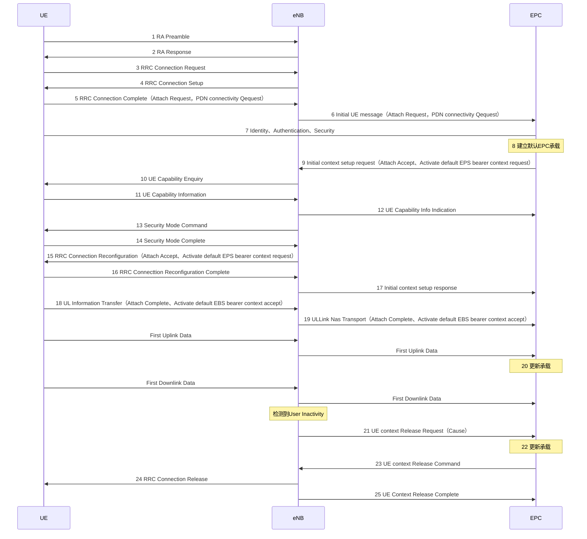

[38.401-无线接入网系统架构]()

```mermaid
    sequenceDiagram
    UE->>eNB:       1 RA Preamble
    eNB->>UE:       2 RA Response
    UE->>eNB:       3 RRC Connection Request
    eNB->>UE:       4 RRC Connection Setup
    UE->>eNB:       5 RRC Connection Complete（Attach Request，PDN connectivity Qequest）
    eNB->>EPC:      6 Initial UE message（Attach Request，PDN connectivity Qequest）
    EPC->UE:        7 Identity、Authentication、Security
    Note over EPC:  8 建立默认EPC承载
    EPC->>eNB:      9 Initial context setup request（Attach Accept、Activate default EPS bearer context request）
    eNB->>UE:      10 UE Capability Enquiry
    UE->>eNB:      11 UE Capability Information
    eNB->>EPC:     12 UE Capability Info Indication
    eNB->>UE:      13 Security Mode Command
    UE->>eNB:      14 Security Mode Complete
    eNB->>UE:      15 RRC Connection Reconfiguration（Attach Accept、Activate default EPS bearer context request）
    UE->>eNB:      16 RRC Connecttion Reconfiguration Complete
    eNB->>EPC:     17 Initial context setup response
    UE->>eNB:      18 UL Information Transfer（Attach Complete、Activate default EBS bearer context accept）
    eNB->>EPC:     19 ULLink Nas Transport（Attach Complete、Activate default EBS bearer context accept）
    UE->>eNB:         First Uplink Data
    eNB->>EPC:        First Uplink Data
    Note over EPC: 20 更新承载
    UE->>eNB:         First Downlink Data
    eNB->>EPC:        First Downlink Data

    Note over eNB:    检测到User Inactivity
    eNB->>EPC:     21 UE context Release Request（Cause）
    Note over EPC: 22  更新承载
    EPC->>eNB:     23 UE context Release Command
    eNB->>UE:      24 RRC Connection Release
    eNB->>EPC:     25 UE Context Release Complete

```