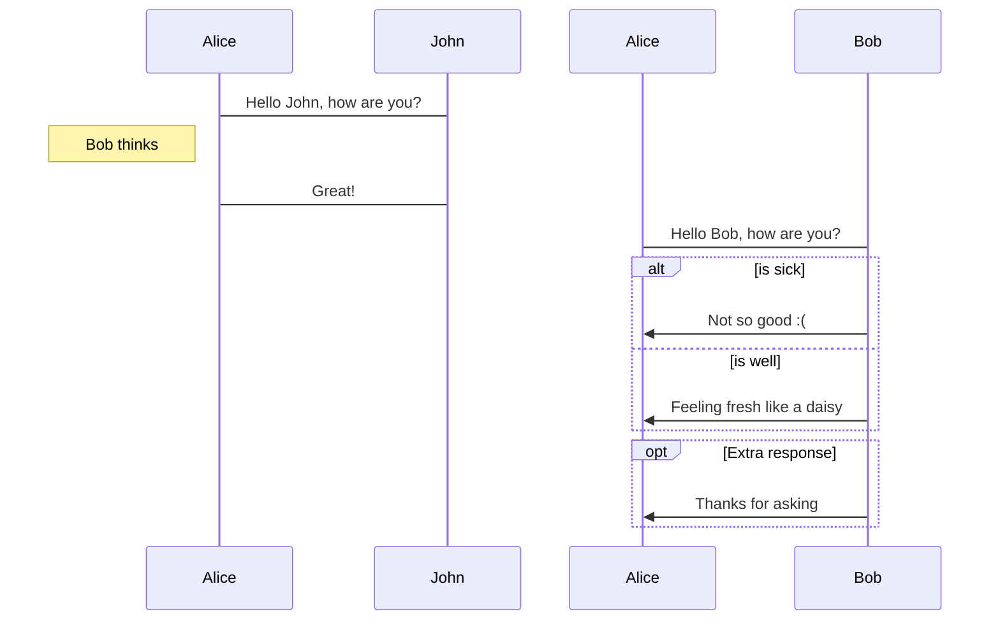

[mermaid](https://juejin.cn/post/6893436635476819982)
## Build

```mermaid
  sequenceDiagram
    participant oai as build_oai
    participant help as build_helper
    oai->>help:source "$THIS_SCRIPT_PATH"/tools/build_helper
    Note right of help:set_openair_env()
```

```mermaid
  sequenceDiagram
    participant A as Alice
    participant J as John
    A->J: Hello John, how are you?
    Note left of A : Bob thinks
    J->A: Great!

    Alice->Bob: Hello Bob, how are you?
    alt is sick
        Bob->>Alice: Not so good :(
    else is well
        Bob->>Alice: Feeling fresh like a daisy
    end
    opt Extra response
        Bob->>Alice: Thanks for asking
    end
```

链接：https://juejin.cn/post/6893436635476819982