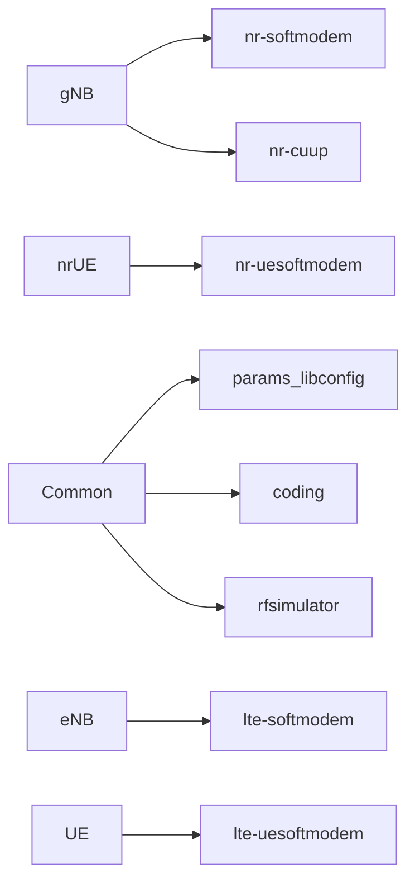
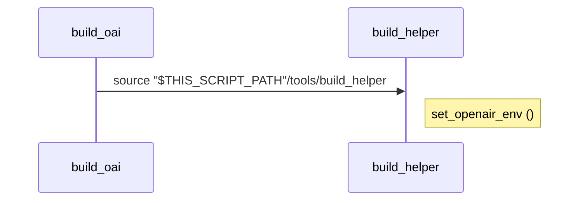
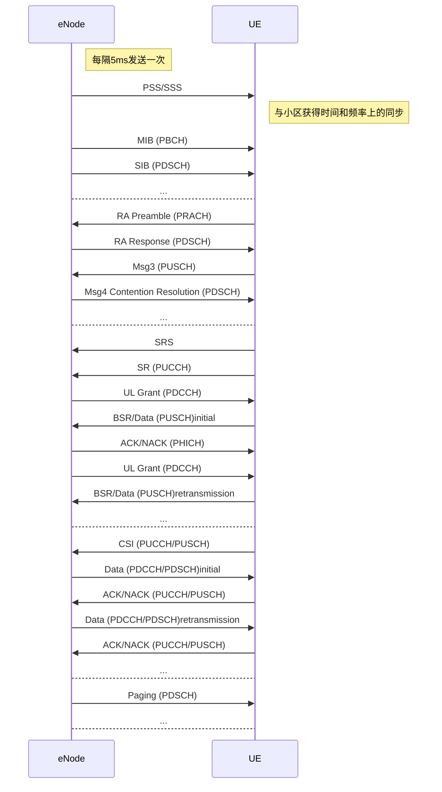

[mermaid] (https://juejin.cn/post/6893436635476819982)
## Build
git clone http://10.167.14.30:8081/gitlab/training/mtc-oai.git
cd openairinterface5g
git checkout feature_mmWave_nfapi_f1ap
source oaienv
cd cmake_targets
sudo -E ./build_oai --gNB --nrUE -x -c -w None
### Parameter

### nr-softmodem

### nr-uesoftmodem

## UE-eNode

链接：https://juejin.cn/post/6893436635476819982