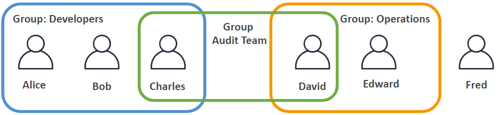

* Type:
* Tags:
* Date: ${date_time}
* Related:
* Reference:

## IAM
IAM  = Identity and Access Management
身份和访问的管理

### 功能
* 创建账号，分配组
* 默认创建了root账号
  * **root账号，仅仅用于创建账号，不做其他使用。**
* 一个账号对应一个组织内部的用户，也可以进行分组
* **组仅包含用户**
* 用户可以不属于任何组，也可以属于多个组

### 权限
* 通过Json文件给用户和组分配权限，这个叫polices（策略）
* policies定于用户的权限
* 不允许每个人都可以做任何灾难性的事情（新用户可能会花费更多的钱，安全隐患）
* 最小特权原则：不给用户超过需要的权限