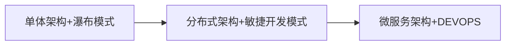
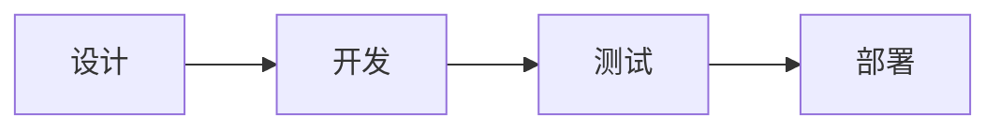
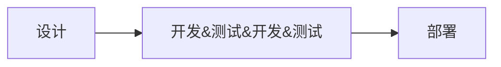
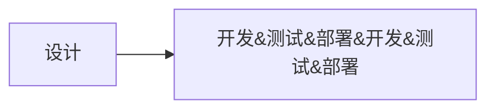

# [什么是AWS？](https://aws.amazon.com/cn/what-is-aws/?nc1=f_cc)
## AWS 云计算
Amazon Web Services (AWS) 是全球最全面、应用最广泛的云平台，从全球数据中心**提供**超过 200 项功能齐全的**服务**。数百万客户（包括增长最快速的初创公司、最大型企业和主要的政府机构）都在使**用 AWS 来降低成本、提高敏捷性并加速创新**。

## 最多的功能
从**计算、存储和数据库等基础设施技术**，到**机器学习、人工智能、数据湖和分析**以及**物联网**等新兴技术，AWS 提供的服务以及其中的功能比其他任何云服务提供商的都要多得多。这使得**将现有应用程序迁移到云**中并**构建**您可以想象的几乎任何东西都变得更快、更容易且更具成本效益。

AWS 的这些服务还具有最为多样复杂的功能。例如，AWS 提供了种类繁多的数据库，这些数据库是为不同类型的应用程序专门构建的，因此您可以**选择适合作业的工具来获得最佳的成本和性能**。

## [什么是云计算？](https://aws.amazon.com/cn/what-is-cloud-computing/?nc1=f_cc)
云计算**通过互联网按需提供 IT 资源**，并且采用**按使用量付费**的定价方式。您可以根据需要从诸如 Amazon Web Services (AWS) 之类的云提供商那里**获得技术服务，例如计算能力、存储和数据库**，而**无需购买、拥有和维护物理数据中心及服务器**。

### [云计算类型](https://aws.amazon.com/cn/types-of-cloud-computing/?WICC-N=tile&tile=types_of_cloud)
* **基础设施即服务 (IaaS)**
基础设施即服务有时缩写为 IaaS，包含云 IT 的基本构建块，通常提供对**联网功能**、**计算机**（虚拟或专用硬件）以及**数据存储空间**的访问。基础设施即服务提供最高等级的灵活性和对 IT 资源的管理控制，其机制与现今众多 IT 部门和开发人员所熟悉的现有 IT 资源最为接近。
* **平台即服务 (PaaS)**
平台即服务**消除了组织对底层基础设施（一般是硬件和操作系统）的管理**需要，让您可以将更多精力放在应用程序的部署和管理上面。这有助于提高效率，因为您不用操心资源购置、容量规划、软件维护、补丁安装或与应用程序运行有关的任何无差别的繁重工作。
* **软件即服务 (SaaS)**
软件即服务提供了一种完善的产品，**其运行和管理皆由服务提供商负责**。人们通常所说的软件即服务指的是**终端用户应用程序**。使用 SaaS 产品时，服务的维护和底层基础设施的管理都不用您操心，您只需要考虑怎样使用 SaaS 软件就可以了。SaaS 的常见应用是基于 Web 的电子邮件，在这种应用场景中，您可以收发电子邮件而不用管理电子邮件产品的功能添加，也不需要维护电子邮件程序运行所在的服务器和操作系统。

### 云计算部署模型
* **云**
基于云的应用程序**完全部署在云中且应用程序的所有组件都在云中运行**。云中的应用程序分为两种，一种是在**云中创建**，另一种是从现有基础设施**迁移到云中**以利用云计算的优势。基于云的应用程序可以构建在基础设施组件上，也可以使用较高级别的服务，这些服务提供了从核心基础设施的管理、架构和扩展要求中抽象提取的能力。
* **混合**
混合部署是一种在基于**云的资源和非云现有资源之间连接**基础设施和应用程序的方法。混合部署最常见的方法是在云和现有本地基础设施之间将组织的基础设施扩展到云中，同时将云资源与内部系统进行连接。有关 AWS 如何帮助进行混合部署的更多信息，请访问混合页面。
* **本地**
使用虚拟化和资源管理工具在**本地部署**资源往往被称作“**私有云**”。本地部署无法提供云计算的诸多优势，但有时采用这种方案是为了能够提供专用资源。大多数情况下，**这种部署模型与旧式 IT 基础设施无异**，都通过应用程序管理和虚拟化技术尽可能提高资源利用率。

## [什么是 DevOps？](https://aws.amazon.com/cn/devops/what-is-devops/?nc1=f_cc)
[概念](https://www.zhihu.com/question/58702398)
DevOps是一种重视“软件开发人员（Dev）”和“IT运维技术人员（Ops）”之间**沟通合作**的文化、运动或惯例。
透过**自动化“软件交付”和“架构变更”的流程**，来使得构建、测试、发布软件能够更加地快捷、频繁和可靠。

**单体架构+瀑布模式**

**分布式架构+敏捷开发模式**

**微服务架构+DEVOPS**

* 拆分解耦是最终的出路，将项目拆成一个个小的服务单独部署
* 拆分部署催生出DEVOPS

### 深度理解DevOps
DevOps 的三大支柱之中，即人（People）、流程（Process）和平台（Platform）。即
DevOps = 人 + 流程 + 平台
人 + 流程 = 文化
流程 + 平台 = 工具
平台 + 人 = 赋能

### devops平台搭建工具
**项目管理**（PM）：jira。运营可以上去提问题，可以看到各个问题的完整的工作流，待解决未解决等；
**代码管理**：gitlab。jenkins或者K8S都可以集成gitlab，进行代码管理，上线，回滚等；
**持续集成CI（Continuous Integration）**：gitlab ci。开发人员提交了新代码之后，立刻进行构建、（单元）测试。根据测试结果，我们可以确定新代码和原有代码能否正确地集成在一起。
**持续交付CD（Continuous Delivery）**：gitlab cd。完成单元测试后，可以把代码部署到连接数据库的 Staging 环境中更多的测试。如果代码没有问题，可以继续手动部署到生产环境中。
**镜像仓库**：VMware Harbor，私服nexus。
**容器**：Docker。
**编排**：K8S。
**服务治理**：Consul。
**脚本语言**：Python。
**日志管理**：Cat+Sentry，还有种常用的是ELK。
**系统监控**：Prometheus。
**负载均衡**：Nginx。
**网关**：Kong，zuul。
**链路追踪**：Zipkin。
**产品和UI图**：蓝湖。
**公司内部文档**：Confluence。
**报警**：推送到工作群。

## AWS 提供的 DevOps 工具
### 持续集成和持续交付
* [AWS CodePipeline](https://aws.amazon.com/cn/codepipeline/)
    自动化持续交付管道，可实现快速、可靠的更新
    AWS CodePipeline 是一种完全托管的**持续交付服务**，
    可以帮助您实现发布管道的自动化，从而实现快速而可靠的应用程序和基础设施更新。
* [AWS CodeBuild](https://aws.amazon.com/cn/codebuild/)
    通过自动扩展构建和测试代码
    AWS CodeBuild 是一项完全托管的**持续集成服务**，
    可编译源代码、运行测试以及生成可供部署的软件包。
* [AWS CodeDeploy](https://aws.amazon.com/cn/codedeploy/)
    实现代码部署自动化以确保应用程序的正常运行时间
    AWS CodeDeploy 是一项将软件自动部署到各种计算服务的**完全托管式部署服务**。
    使用 CodeDeploy 自动执行软件部署，而无需执行容易出错的手动操作。
    计算服务：（例如 Amazon Elastic Compute Cloud（EC2）、Amazon Elastic Container Service（ECS）、AWS Lambda 和本地服务器）
* [AWS CodeStar](https://aws.amazon.com/cn/codestar/)
    在 AWS 上快速开发、构建和部署应用程序
    AWS CodeStar **提供了您在 AWS 上快速开发、构建和部署应用程序所需的工具**。
    借助 AWS CodeStar，您可以使用各种项目模板开始在 Amazon EC2、AWS Lambda 和 AWS Elastic Beanstalk 上开发应用程序。
    AWS CodeStar 项目支持多种常用编程语言，包括 Java、JavaScript、PHP、Ruby 和 Python。
    AWS CodeStar 提供了一种预配置的持续交付工具链，用于在 AWS 上开发、构建、测试和部署项目，让您可以加快应用程序的交付速度。
    通过针对不同角色（包括所有者、参与者和观察者）的内置安全策略，您可以轻松保证项目的安全访问。
    AWS CodeStar 中的项目控制面板让您可以轻松集中监控应用程序活动和管理日常开发任务（例如近期的代码提交、构建和部署）。
    AWS CodeStar 集成了 Atlassian JIRA 这种第三方问题跟踪和项目管理工具，因此您可以在 AWS CodeStar 控制面板中创建和管理 JIRA 问题。
### 微服务
* [Amazon Elastic Container Service (Amazon ECS)](https://aws.amazon.com/cn/ecs/)
    运行高度安全、可靠且可扩展的容器
    Amazon ECS 是一项**完全托管式容器编排服务**，您可以用它轻松部署、管理和扩展容器化的应用程序。
* [AWS Lambda](https://aws.amazon.com/cn/lambda/)
    无需考虑服务器或集群即可运行代码
    AWS Lambda 是一项**无服务器事件驱动型计算服务**，该服务使您可以运行几乎任何类型的应用程序或后端服务的代码，而无需预置或管理服务器。
    您可以从 200 多个 AWS 服务和软件即服务 (SaaS) 应用程序中触发 Lambda，且只需按您的使用量付费。
### 基础设施即代码
* [AWS CloudFormation](https://aws.amazon.com/cn/cloudformation/)
    借助**基础设施即代码**加快云预置
    AWS CloudFormation 允许您通过将基础设施视为代码来建模、预置和管理 AWS 和第三方资源。
* [AWS OpsWorks ](https://aws.amazon.com/cn/opsworks/)
    利用 Chef 和 Puppet 实现操作自动化
    AWS OpsWorks 是一款**配置管理服务**，提供 **Chef** 和 **Puppet** 的托管实例。
    Chef 和 Puppet 是自动化平台，允许您使用代码来自动配置服务器。
    借助 OpsWorks，您可以使用 Chef 和 Puppet 自动完成所有 Amazon EC2 实例或本地计算环境中的服务器配置、部署和管理。
    OpsWorks 提供三种产品：**AWS Opsworks for Chef Automate**、**AWS OpsWorks for Puppet Enterprise** 和 **AWS OpsWorks Stacks**。
    * [AWS Opsworks for Chef Automate](https://aws.amazon.com/cn/opsworks/chefautomate/)
        完全托管的 Chef 服务器和 Chef Automate
        AWS OpsWorks for Chef Automate 可以提供一个完全托管的 Chef Automate 服务器和全套自动化工具，让您可以**通过工作流自动化来实现连续部署以及合规性与安全性的自动测试**，并能通过一个用户界面**查看各种节点及其状态**。
        **Chef Automate** 平台可以处理软件与操作系统配置、持续合规性、软件包安装和数据库设置等多种操作任务，让您实现全栈自动化。
        **Chef 服务器**可以集中存储您的配置任务，并将其提供给任意规模的计算环境中的每个节点，节点数量既可以是几个也可以是数千个。
        OpsWorks for Chef Automate 与 Chef 社区中提供的各种工具和说明书完全兼容，并会将新的节点自动注册到您的 Chef 服务器。 
    * [AWS OpsWorks for Puppet Enterprise](https://aws.amazon.com/cn/opsworks/puppetenterprise/)
        完全托管的 Puppet Master
        AWS OpsWorks for Puppet Enterprise 是一项完全托管的**配置管理服务**，它托管 Puppet Enterprise。
        Puppet Enterprise 是一套来自 Puppet 的用于基础设施和应用程序管理的自动化工具。
        OpsWorks 还通过自动修补、更新和备份服务器来维护您的 Puppet 主服务器。
        借助 OpsWorks，您无需运营自己的配置管理系统，也不用操心其基础设施的维护。
        OpsWorks 可让您**访问通过 Puppet 控制台管理的所有 Puppet Enterprise 功能**。
        它还可以与您现有的 Puppet 代码无缝协作。
    * [AWS OpsWorks Stacks](https://aws.amazon.com/cn/opsworks/stacks/)
        利用 Chef 自动执行操作
        AWS OpsWorks Stacks 让您可以**管理 AWS 上和本地的应用程序和服务器**。
        利用 OpsWorks Stacks，您可以将自己的应用程序塑造成一个包含不同层级 (例如负载均衡层、数据库层和应用程序服务器层) 的堆栈。
        您可以在每个层级部署和配置 Amazon EC2 实例，也可以连接 Amazon RDS 数据库等其他资源。
        OpsWorks Stacks 让您可以将服务器设置为根据预先设定的时间表或针对不断变化的流量水平自动扩展，并使用生命周期钩子来随着环境的扩展而协调各种变化。
        您可以通过 Chef Solo 来运行各种 Chef 方案，从而自动执行软件包安装、语言或框架编程和软件配置等多种任务。
* [AWS Systems Manager](https://aws.amazon.com/cn/systems-manager/)
    获得对 AWS 和本地资源的运营洞察
    AWS Systems Manager 是一种适用于混合云环境的安全的端到端管理解决方案。
    AWS Systems Manager 是您的 AWS 应用程序和资源的运营中心，分为四个核心功能组。
    * 运营管理
        * [Explorer](https://aws.amazon.com/cn/systems-manager/features/#Explorer)
        * [OpsCenter](https://aws.amazon.com/cn/systems-manager/features/#OpsCenter)
        * [Incident Manager](https://aws.amazon.com/cn/systems-manager/features/#Incident_Manager)
    * 应用程序管理
        * [Application Manager](https://aws.amazon.com/cn/systems-manager/features/#Application_Manager)
        * [AppConfig](https://aws.amazon.com/cn/systems-manager/features/#AppConfig)
        * [Parameter Store](https://aws.amazon.com/cn/systems-manager/features/#Parameter_Store)
    * 变更管理
        * [自动化](https://aws.amazon.com/cn/systems-manager/features/#Automation)
        * [Change Manager](https://aws.amazon.com/cn/systems-manager/features/#Change_Manager)
        * [维护时段](https://aws.amazon.com/cn/systems-manager/features/#Maintenance_Windows)
    * 节点管理
        * [Fleet Manager](https://aws.amazon.com/cn/systems-manager/features/#Fleet_Manager)
        * [会话管理器](https://aws.amazon.com/cn/systems-manager/features/#Session_Manager)
        * [补丁管理器](https://aws.amazon.com/cn/systems-manager/features/#Patch_Manager)

* [AWS Config](https://aws.amazon.com/cn/config/)
    评估、审核和评价资源的配置
    AWS Config 将持续评估、审核和评价资源的配置和关系。

### 监控和日志记录
* [Amazon CloudWatch](https://aws.amazon.com/cn/cloudwatch/)
    观察并监控 AWS 上、本地和其他云中的资源和应用程序
    Amazon CloudWatch 会在自动化控制面板中收集并可视化实时日志、指标和事件数据，从而简化您的基础设施和应用程序维护。
* [AWS X-Ray](https://aws.amazon.com/cn/xray/)
    分析与调试分布式生产应用程序
    AWS X-Ray 通过您的应用程序时会提供完整的请求视图，并通过无代码和低代码移动过滤负载、函数、轨迹、服务、API 等方面的可视化数据。
* [AWS CloudTrail](https://aws.amazon.com/cn/cloudtrail/)
    跟踪用户活动和 API 使用情况
    AWS CloudTrail 监控和记录您的 AWS 基础设施中的账户活动，让您能够控制存储、分析和修复操作。
* [Amazon DevOps Guru](https://aws.amazon.com/devops-guru/)
    通过 ML 驱动型云运维提高应用程序可用性
    Amazon DevOps Guru 使用 ML 来检测异常运维模式，以便在运维问题影响客户之前识别这些问题。
### 平台即服务
* [AWS Elastic Beanstalk](https://aws.amazon.com/cn/elasticbeanstalk/)
    部署和扩展 Web 应用程序
    AWS Elastic Beanstalk 可部署 Web 应用程序，因此您可以专注于您的业务。
### 版本控制
* [AWS CodeCommit](https://aws.amazon.com/cn/codecommit/)
    安全托管高度可扩展的私有 Git 存储库，并协作处理代码
    AWS CodeCommit 是一项安全、高度可扩展的完全托管式源代码控制服务，可用于托管私有 Git 存储库。

## 什么是容器？

| 缩写   | 全称                             |                                                                                                           |
| ------ | -------------------------------- | --------------------------------------------------------------------------------------------------------- |
| AWS    | Amazon Web Services              |                                                                                                           |
| IaaS   | Infrastructure as a Service      | 基础设施即服务                                                                                            |
| PaaS   | Platform as a Service            | 平台即服务一般                                                                                            |
| SaaS   | Software as a Service            | 软件即服务                                                                                                |
| DevOps | Development和Operations的组合词  | 开发运维一体化:是一种重视“软件开发人员（Dev）”和“IT运维技术人员（Ops）”之间**沟通合作**的文化、运动或惯例 |
| EC2    | Amazon Elastic Compute Cloud     |
| ECS    | Amazon Elastic Container Service |

