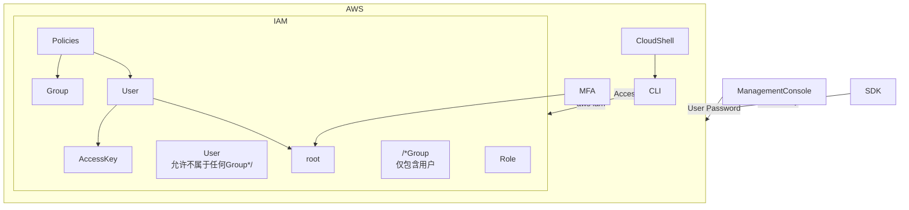

## Relationship

* Management Console
  * CloudShell
  * IAM
    * User
      * root
        * MFA
      * Policies
        * Json 
      * Access Key
    * Group
    * Role
* SDK
* CLI
  * aws --version
  * aws iam list-users

[mermaid](https://juejin.cn/post/6893436635476819982)