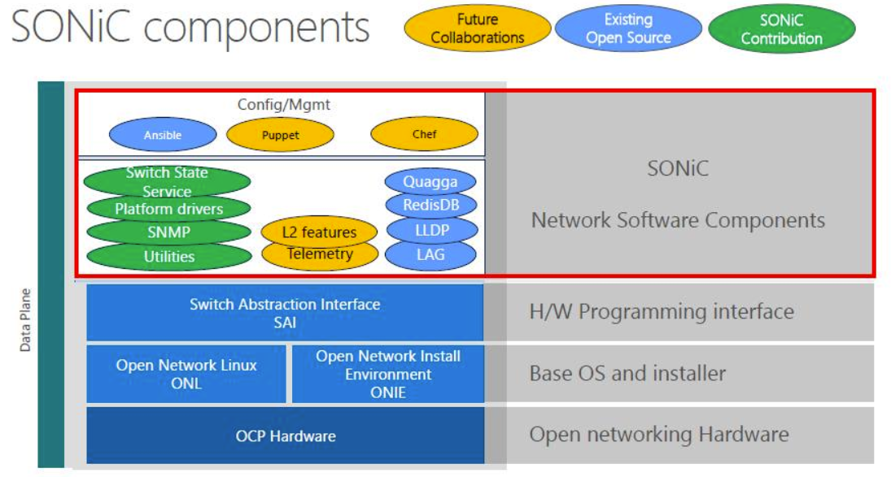
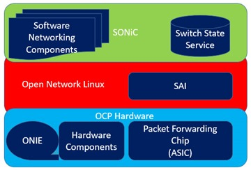

* Type:
* Tags:
* Date: 2023-03-27 16:19:37
* Related:
* Reference:

## SONiC
SONiC (Software for Open Network in the Cloud) 是由微软于2016年发起，并在2017年贡献给OCP的项目。SONiC的所有软件功能模块都开源，这极大地推动了OCP（Open Compute Project, 开发计算项目）社区以及其他厂商/用户在开放网络方面的创新。
SONiC通过将SAI作为南北向互联的中间件，屏蔽不同ASIC之间的驱动差异，也正是由于SAI的存在，SONiC的网络功能应用才能够支持多个厂家的ASIC。
络软件建立在交换机抽象接口（SAI，SAI接口适配ASIC的工作由各个厂家实现）上，使其可以运行在各种硬件设备中，形成白盒交换机软件生态链。
SONiC (Software for Open Network in the Cloud) 是构建网络设备（如交换机）所需功能的**软件集合**
它可以通过交换机 换抽象接口（[[SAI#SAI|SAI]]），运行在不同的[[ASIC#ASIC|ASIC]]平台

SAI向上给SONiC提供了一套统一的API接口。
向下则对接不同的ASIC。

其架构特点主要体现在3个方面
* SAI接口：SAI是SONiC的核心，并为SONiC提供了统一的API。设备厂家、网络开发者可以基于芯片厂家提供的SAI接口开发应用，而不需要关心底层硬件实现，加速产品迭代与创新；
* 数据库架构：在数据库架构方面，SONiC使用数据库架构代替原有的模块化耦合架构，将应用模块之间的传递数据模式变成应用模块之间通过数据库进行数据交换的模式，从关注流程转变为关注数据，实现了功能模块之间的解耦。数据库成为了所有模块的枢纽，模块与模块之间解耦，数据库是稳定的，各个模块升级与故障不会影响其他模块，在整个切换过程中转发面不受到影响；
* 容器化组件：容器化使得SONiC具有极高的可扩展性，网络运营管理人员能够快速引入第三方、专有或开源组件，而不对原有业务造成影响；
* 与内核交互少： 运行在用户空间的SONiC系统，只有为数很少的模块（pmon、swss和syncd）与Linux内核之间存在交互关系，从而保证了系统的稳定性。

SWSS容器
![[SWSS#SWSS|SWSS]]容器
syncd 容器
![[syncd#syncd|syncd]]容器
网络应用容器
* lldp：链路层发现协议容器，在其中运行以下进程：
  * 1) lldpd：LLDP服务，它与外部对等方建立LLDP连接，以公布和接收系统功能。
  * 2) lldp_syncd：此服务将lldp发现状态上载到redis引擎（集中式系统的消息基础结构），将lldp状态传递给需要它的应用程序，如SNMP。
  * 3) lldpmgr：lldpd服务的配置工具。
* snmp：承载snmp功能。此容器中有两个相关流程：
  * 1) snmpd：处理来自外部网络元素的传入SNMP轮询的服务器。
  * 2) snmp代理：这是SONiC对AgentX snmp子代理SONiC_ax_impl的实现。sonic_ax_impl子代理向主代理（snmpd）提供从集中式Redis引擎中的sonic数据库收集的信息。
* pmon: 此容器是Sensord 服务运行的地方。sensord定期记录硬件组件的传感器读数，并在触发报警时发出警报。pmon容器还承载fancontrol进程，该进程从相应的平台驱动程序收集与风扇相关的状态。
* bgp: 运行路由堆栈。BGP容器运行以下服务: 
  * 1) bgpd：标准的BGP服务。外部方的路由状态通过常规TCP或UDP套接字接收，并通过zebra/fpmsyncd接口向下推送到转发平面。
  * 2) zebra：传统的IP路由管理器。它提供内核路由表更新、接口查找和跨各种路由协议的路由重新分配服务。zebra还通过netlink将计算出的FIB向下推送到内核，并通过转发平面管理器（FPM）推送到转发过程中涉及的南向组件。
  * 3) fpmsyncd：此服务收集zebra生成的FIB状态，并将其内容转储到redis引擎内的应用程序数据库（APPL_DB）中。

## 参考资料
* [SONiC架构分析](https://bbs.huaweicloud.com/blogs/303604)
* [SONiC学习笔记（1）--SONiC架构与各模块功能](https://blog.csdn.net/weixin_42896572/article/details/119209184)
* [SONiC学习笔记（2）--SONiC架构中各模块间的交互](https://blog.csdn.net/weixin_42896572/article/details/119347975)