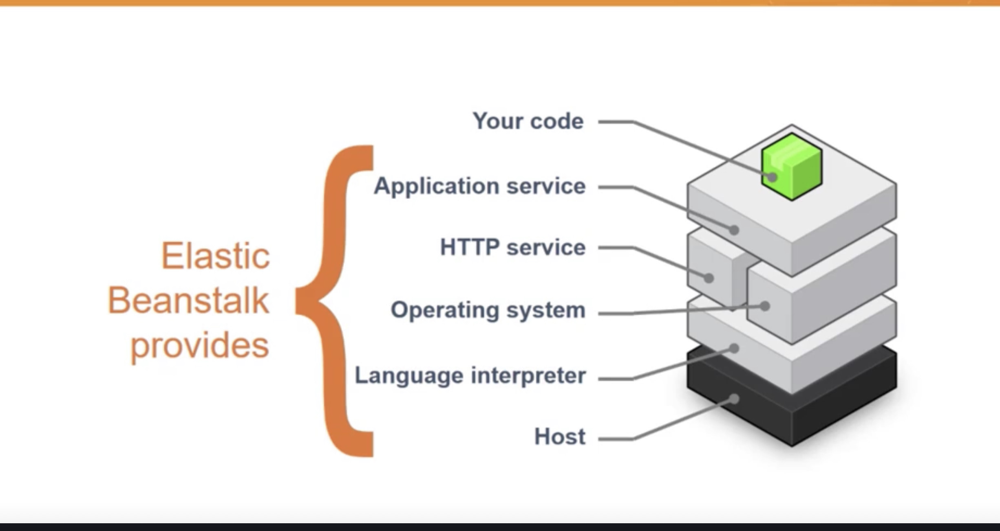

# 考核内容
* [Associate_Exam-Guide_C02.pdf](AWS-Certified-Developer-Associate_Exam-Guide_C02.pdf)

- 考核内容：
    - 领域 1： 使用 AWS 服务进行开发 32%
    - 领域 2： 安全 26%
    - 领域 3： 部署 24%
    - 领域 4： 故障排除和优化 18%

- 考试语言： 
    - 英语, 日语, 中文(简体), 韩语, 法语, 德语, 西班牙语, 葡萄牙语（巴西）, 俄语, 中文(繁体), 意大利语, 印度尼西亚语(印度尼西亚), 阿拉伯语(沙特阿拉伯) 

- 考试费： 
    - $115 USD（折合人民币：800元左右） 

- 培训： 
    - 线上培训（免费） https://learn.microsoft.com/en-us/training/paths/create-azure-app-service-web-apps/ 
    - 讲师指导（收费） 

- 模拟考试：包含所有的考试题目 
    - https://www.mindhub.com/az-204-developing-solutions-for-microsoft-azure-microsoft-official-practice-test/p/MU-AZ-204?utm_source=microsoft&utm_medium=certpage&utm_campaign=msofficialpractice 

- 及格分数：700 分（满分1000分） 
    - 官网：https://learn.microsoft.com/en-us/certifications/azure-developer/ 

---

# 建议学习计划

| 章节                                                              | 小节              | 计划时间              | 进度 |
| ----------------------------------------------------------------- | ----------------- | --------------------- | ---- |
| **基础**                                                          | **16 hours**      |                       |      |
| Introduction to AWS Elastic Beanstalk                             | 10 minutes        | 2023/02/27~2023/03/03 |      |
| Getting Started with .NET on AWS                                  | 1 hour 30 minutes |                       |      |
| Accelerating Messaging Modernization with Amazon MQ               | 1 hour 30 minutes |                       |      |
| Introduction to Containers                                        | 15 minutes        |                       |      |
| Introduction to AWS Fargate                                       | 10 minutes        |                       |      |
| Deep Dive on AWS Fargate: Building Serverless Containers at Scale | 40 minutes        | 2023/03/06~2023/03/10 |      |
| Deep Dive on Container Security                                   | 30 minutes        |                       |      |
| Amazon Elastic Container Service (ECS) Primer                     | 30 minutes        |                       |      |
| Amazon EKS Primer                                                 | 1 hour 15 minutes |                       |      |
| Introduction to Serverless Development                            | 25 minutes        |                       |      |
| Getting into the Serverless Mindset                               | 30 minutes        |                       |      |
| AWS Lambda Foundations                                            | 2 hours           | 2023/03/27~2023/03/31 |      |
| Amazon API Gateway for Serverless Applications                    | 2 hours           |                       |      |
| Amazon DynamoDB for Serverless Architectures                      | 2 hours           | 2023/04/03~2023/04/07 |      |
| Getting Started with DevOps on AWS                                | 1 hour            |                       |      |
| Build and Deploy APIs with a Serverless CI/CD                     | 50 minutes        |                       |      |
| Exam Readiness: AWS Certified Developer – Associate (Digital)     | 2 hours           |                       |      |

## 其他资料
需要重点学习的白皮书（官网指定）
    AWS 安全性最佳实践 
    AWS 架构完善的框架设计
    云架构：AWS 最佳实践 
    在 AWS 上练习持续集成和持续交付：
    使用开发运营加速软件交付
    AWS 上的微服务 
    使用 AWS Lambda 的无服务器架构
    使用无服务器架构优化企业经济 
    在 AWS 上运行容器化微服务
    在 AWS 上实施蓝绿部署

需要重点了解的常见问题：（官网指定）
    Amazon Simple Queue Service
    Amazon DynamoDB - FAQs
    Amazon ElastiCache
    Amazon Kinesis AWS Lambda – FAQs
    Amazon API Gateway – FAQs
    AWS Elastic Beanstalk
    AWS Identity and Access Management
    AWS Key Management Service

AWS在线课堂：
    AWS Technical Essentials
    Developing on AWS
    Advanced Developing on AWS
    Exam Readiness
---

# 丰富学习计划
| 章节                                                                                          | 小节                           | 计划时间              | 进度 |
| --------------------------------------------------------------------------------------------- | ------------------------------ | --------------------- | ---- |
| **Step 1: Learn AWS developer fundamentals**                                                  | **3 days 6 hours 10 minutes**  | 2023/04/10~2023/04/14 |      |
| Tools to Build on AWS                                                                         | 30 minutes                     |                       |      |
| Introduction to AWS Elastic Beanstalk                                                         | 10 minutes                     |                       |      |
| Getting Started with .NET on AWS                                                              | 90 minutes                     |                       |      |
| Getting Started with .NET on AWS                                                              | 2 hours                        |                       |      |
| Learn how to migrate your ASP.NET app to AWS in minutes!                                      | 30 minutes                     |                       |      |
| Learn the basics of Python on AWS                                                             | 90 minutes                     |                       |      |
| Developing on AWS                                                                             | 3 days                         |                       |      |
| **Step 2: Learn to build modern applications**                                                | **20 hours 55 minutes**        |                       |      |
| Implementing Microservices on AWS                                                             | 1 hours                        |                       |      |
| Building Modern Applications at AWS                                                           | 25 minutes                     |                       |      |
| Building Modern Java Applications on AWS                                                      | ~~18 hours~~                   |                       |      |
| Building Modern Node.js Applications on AWS                                                   | ~~18 hours~~                   |                       |      |
| Building Modern Python Applications on AWS                                                    | 18 hours                       |                       |      |
| Accelerating Messaging Modernization with Amazon MQ                                           | 30 minutes                     |                       |      |
| Modern Application Development on AWS                                                         | 1 hour                         |                       |      |
| **Step 3: Learn all about containers**                                                        | **12 hours 5 minutes**         |                       |      |
| Introduction to Containers                                                                    | 15 minutes                     |                       |      |
| Introduction to AWS Fargate                                                                   | 10 minutes                     |                       |      |
| Building Containerized Applications on AWS                                                    | 10 hours                       |                       |      |
| AWS App2Container – A New Containerizing Tool for Java and .NET Applications                  | 30 minutes                     |                       |      |
| Deep Dive on AWS Fargate: Building Serverless Containers at Scale                             | 40 minutes                     |                       |      |
| Deep Dive on Container Security                                                               | 30 minutes                     |                       |      |
| **Step 3.1: Learn about Amazon Elastic Container Service (Amazon ECS)**                       | **6 hours 12 minutes**         |                       |      |
| Amazon Elastic Container Service (ECS) Primer                                                 | 30 minutes                     |                       |      |
| ECS Workshop                                                                                  | 2 hours                        |                       |      |
| Best practices for CI/CD using AWS Fargate and Amazon ECS                                     | 60 minutes                     |                       |      |
| Introduction to Amazon Elastic Container Service                                              | 50 mins                        |                       |      |
| Introduction to Amazon Elastic Container Registry                                             | 57 mins                        |                       |      |
| Working with Amazon Elastic Container Service                                                 | 55 mins                        |                       |      |
| **Step 3.2: Learn about Amazon Elastic Kubernetes Service (Amazon EKS)**                      | **3 days 3 hours 30 minutes**  |                       |      |
| Amazon Elastic Kubernetes Service (EKS) Primer                                                | 1 hour                         |                       |      |
| Running Containers on Amazon Elastic Kubernetes Service (Amazon EKS)                          | 3 days                         |                       |      |
|                                                                                               | 2 hours                        |                       |      |
| De-mystifying cluster networking for Amazon EKS Worker nodes                                  | 30 minutes                     |                       |      |
| **Step 4: Learn all about serverless fundamentals**                                           | **5 hours 30 minutes**         |                       |      |
| Introduction to Serverless Development                                                        | 25 minutes                     |                       |      |
| Getting into a Serverless Mindset                                                             | 30 minutes                     |                       |      |
| AWS Lambda Foundations                                                                        | 1 hour                         |                       |      |
| Amazon API Gateway for Serverless Applications                                                | 75 minutes                     |                       |      |
| Amazon DynamoDB for Serverless Architectures                                                  | 2 hours                        |                       |      |
| Getting Started with Lambda Tutorial                                                          | 20 minutes                     |                       |      |
| **Step 4.1: Dive deeper with serverless**                                                     | **3 days 18 hours 40 minutes** |                       |      |
| Developing Serverless Solutions on AWS                                                        | 3 days                         |                       |      |
| Introduction to Lambda                                                                        | 45 minutes                     |                       |      |
| Introduction to Amazon API Gateway                                                            | 55 minutes                     |                       |      |
| Architecting Serverless Solutions                                                             | 3 hours                        |                       |      |
| Innovator Island serverless workshop                                                          | 2 hours                        |                       |      |
|                                                                                               | 5 hours                        |                       |      |
| Build a Modern Web Application in your preferred language                                     | 2 hours                        |                       |      |
| Modernization Workshops with 3rd Party Integration                                            | 2 hours                        |                       |      |
| Security Overview of AWS Lambda                                                               | 1 hour                         |                       |      |
| Create a near real-time multiplayer game built on AWS                                         | 2 hours                        |                       |      |
| AWS Serverless Ramp-Up Guide                                                                  |                                |                       |      |
| **Step 5: Get started with DevOps on AWS**                                                    |
| Getting Started with DevOps on AWS                                                            | 60 minutes                     |                       |      |
| CI/CD for serverless applications                                                             | 1 hour                         |                       |      |
| Build and Deploy APIs with a Serverless CI/CD                                                 | 45 minutes                     |                       |      |
| AWS DevOps Ramp-Up Guide                                                                      |                                |                       |      |
| **Step 6: Prepare for and take the AWS Certified Developer - Associate certification exam**   |
| Exam Readiness: AWS Certified Developer – Associate                                           | 2 hours                        |                       |      |
| AWS Certified Developer – Associate exam                                                      | 2 hours                        |                       |      |
| **Step 7: Learn how to quickly and easily build secure and scalable full stack applications** |
| Build web and mobile apps with AWS Amplify                                                    | 30 minutes                     |                       |      |
| Build a React Application using AWS Amplify                                                   | 50 minutes                     |                       |      |
| Build a Full-Stack iOS App using AWS Amplify                                                  | 45 minutes                     |                       |      |
| Mobile applications how to blog directory                                                     | 30 minutes                     |                       |      |
| **Step 8: Continue your learning with advanced topics**                                       |
| Advanced Developing on AWS                                                                    | 3 days                         |                       |      |
| Instrumenting distributed systems for operational visibility                                  | 60 minutes                     |                       |      |

---

# 学习笔记

## 英语词汇整理

| 缩写   | 全称                            |                                                                                            |
| ------ | ------------------------------- | ------------------------------------------------------------------------------------------ |
| AWS    | Amazon Web Services             |                                                                                            |
| IaaS   | Infrastructure as a Service     | 基础设施即服务                                                                             |
| PaaS   | Platform as a Service           | 平台即服务一般                                                                             |
| SaaS   | Software as a Service           | 软件即服务                                                                                 |
| DevOps | Development和Operations的组合词 | 开发运维一体化:是一种重视“软件开发人员（Dev）”和“IT运维技术人员（Ops）”之间**沟通合作**的文化、运动或惯例 |

## AWS的主要服务

* 计算
    * EC2 (Elastic Compute Cloud) – 虚拟主机服务
    * Lambda – 无服务服务
    * Amazon LightSail – VPS服务

* 存储/数据库
    * Amazon RDS – 关系型数据库服务
    * Amazon DynamoDB – 非关系型数据库服务
    * Amazon RedShift – 数据仓库服务
    * Amazon S3 – 文件存储服务

* 迁移
    * Amazon DMS – 数据库迁移服务

* 网络和内容分发
    * VPC – DHCP和基本网络服务
    * AWS Route 53 – DNS服务
    * AWS DirectConnect & VPN – 网络专线和VPN服务
    * AWS CloudFront – CDN服务

* 管理工具
    * AWS CloudWatch – 监控资源和应用程序
    * AWS Systems Manager – 了解运行状况并对 AWS 资源采取行动
    * AWS CloudTrail – 跟踪用户活动和 API 使用情况
    * AWS Config – 跟踪资源库和变更
    * AWS OpsWorks – 利用 Chef 和 Puppet 实现操作自动化
    * AWS Trusted Advisor – 优化性能和安全性

* 安全和身份认证
    * Amazon IAM – 认证和身份管理服务

* 消息管理
    * Amazon SQS – 消息队列服务
    * Amazon SNS – 消息服务（邮箱通知，短信通知）

## Introduction to AWS Elastic Beanstalk
Elastic Beanstalk 是AWS的服务。
让开发人员在 AWS 云中快速部署和管理应用程序。
使用者只需要上传应用程序，Elastic Beanstalk 将自动处理容量预配置、负载均衡、Auto Scaling 和应用程序运行状况监控的部署细节
Elastic Beanstalk 支持 Java、.NET、PHP、Node.js、Python、Ruby、Go 和 Docker Web 应用程序。

* Platform as a Service
* Allows quick deployment of your applications
* Reduces management complexity
* Keeps control in your hands
    * Choose your instance type
    * Choose your database
    * Set and adjust Auto Scaling
    * Update your application
    * Access server log files
    * Enable HTTPS on load balancer
* Supports a large range of platforms
    * Packer Builder
    * Single Container, Multicontainer,or Preconfigured Docker
    * GO
    * Jave SE
    * Java with Tomcat
    * .NET on Windows Server with IIS
    * Node.js
    * PHP
    * Python
    * Ruby

### 参考资料
* [开发人员指南](https://docs.aws.amazon.com/zh_cn/elasticbeanstalk/latest/dg/Welcome.html)

## Getting Started with .NET on AWS
## Accelerating Messaging Modernization with Amazon MQ
## Introduction to Containers
## Introduction to AWS Fargate
## Deep Dive on AWS Fargate: Building Serverless Containers at Scale
## Deep Dive on Container Security
## Amazon Elastic Container Service (ECS) Primer
## Amazon EKS Primer
## Introduction to Serverless Development
## Getting into the Serverless Mindset
## AWS Lambda Foundations
## Amazon API Gateway for Serverless Applications
## Amazon DynamoDB for Serverless Architectures
## Getting Started with DevOps on AWS
## Build and Deploy APIs with a Serverless CI/CD
## Exam Readiness: AWS Certified Developer – Associate (Digital)
