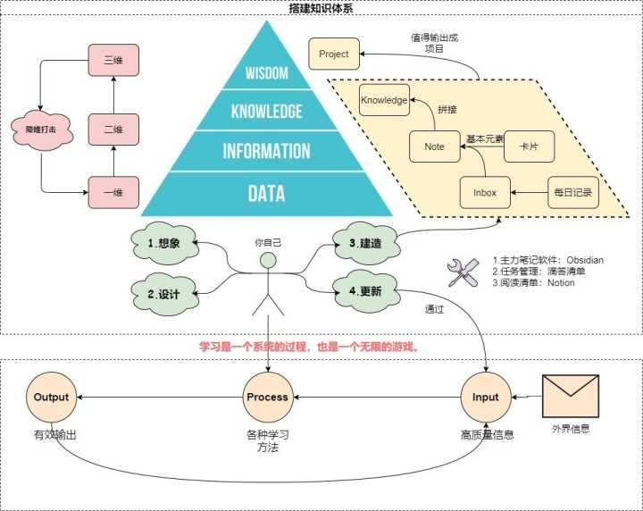

# NoteBook

## [如何建立自己的知识体系和观点？](https://www.zhihu.com/question/52782284/answer/1798716003)

### 怎么搭建自己的知识体系？
快递分发（微观）——INKP管理法 底层思维：IPO学习法、框架思维
地图导航（宏观）——知识地图 底层思维：建立第二大脑、卡片大法
#### 游戏规则
我们通过卡片大法来记录平时生活中接触到的信息，利用INKP管理法（底层是框架思维以及IPO学习法）将索引存储于我们的大脑之中，具体的信息存储于我们的第二大脑，输出对应的内容进一步进行有序化，最后形成属于自己的知识星球。
##### 元素——卡片
@import "Template\BasicInfo.md"

##### 容器——第二大脑
通过建立第二大脑减轻自己的记忆负担，更多地用于思考
笔记软件**obsidian**

##### 方法——INKP管理法
@import "Template\INKP.md"

##### 人物——你自己
没有任何人能够代替你自己来完成

#### 开始游戏
##### Step1 Imagine——想象
先对自己想要学习的内容有一个大致的预估。
以一个季度为单位去学习不同主题的内容，比如说读书方法、任务管理、心理学等等领域。
要想更好地学习这些知识，就得更好地去掌握学习的本质，也就是各种学科的元学科——认知科学。
要学会给自己画饼嘛~
##### Step2 Design——设计
要根据自己的实际情况量力而行
要素
（1）你的目的是什么
不要为了学习而学习，不然你只会发现你学了一些技能、方法，可能刚开始觉得很有价值，但是总会觉得没有办法能够应用到实践中。
（2）了解基本常识
搭建知识体系的过程就是在我们的头脑里不断地搭积木的过程，那么前提是我们得有这些积木。
（3）大时间周期
##### Step3 Build——建造
###### （1）万能材料——卡片
###### （2）信息流动——INKP管理法
###### （1）万能材料——卡片
###### 
##### Step4 Update——更新

成长型思维。更多地去关注自己的成长和进步，而不是去关注自己欠缺的东西。
---
* 知乎大V，比如L先生、采铜、常青、思维有了模型一系列厉害人物
---

## [效率爆表！分享一套完整的个人工具流+高效笔记方式](https://zhuanlan.zhihu.com/p/440575138)
* 用者无机心
**机心**指的是「机巧功利之心」，说的是我们太过于依赖工具去提高「效率」，结果到头来却忽略了「效能」
**效率**指的是正确地做事儿
**效能**指的是做正确的事儿
应该摒弃**机心**，先完成再完美

* 工具选择三条原则：
  1. **如无必要，勿增实体**：只有当你真正有这样的需求时才会去思考我该怎么通过增加工具来优化我的知识生产方式。
  2. **跨平台与同步性**
  3. **数据安全**

知乎大V，比如L先生、采铜、常青、思维有了模型